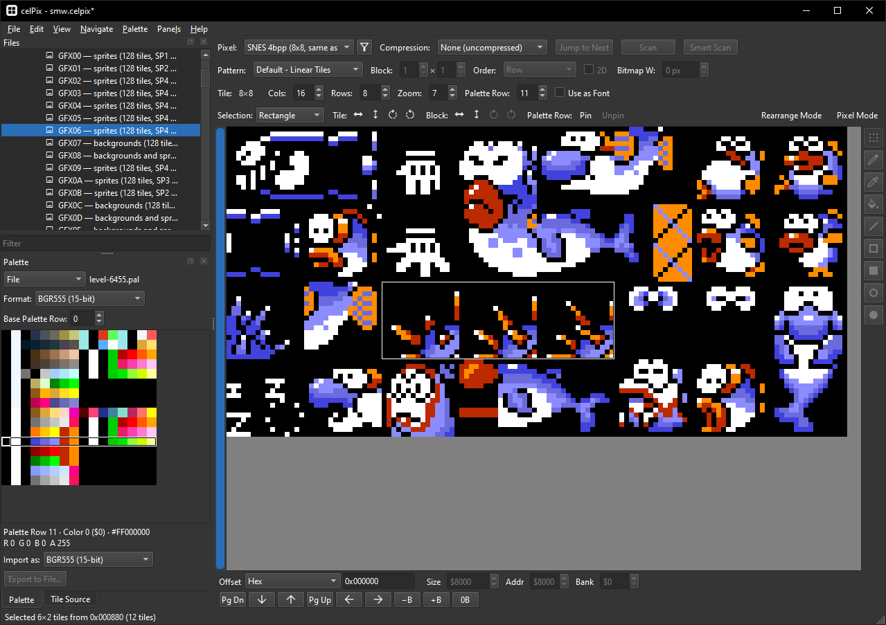
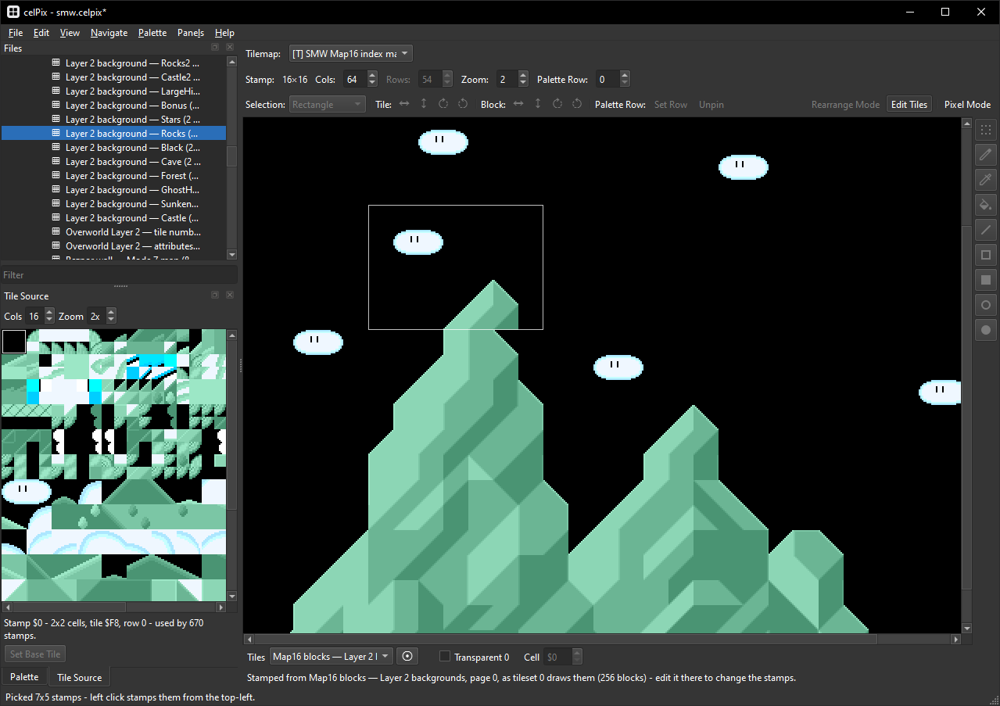
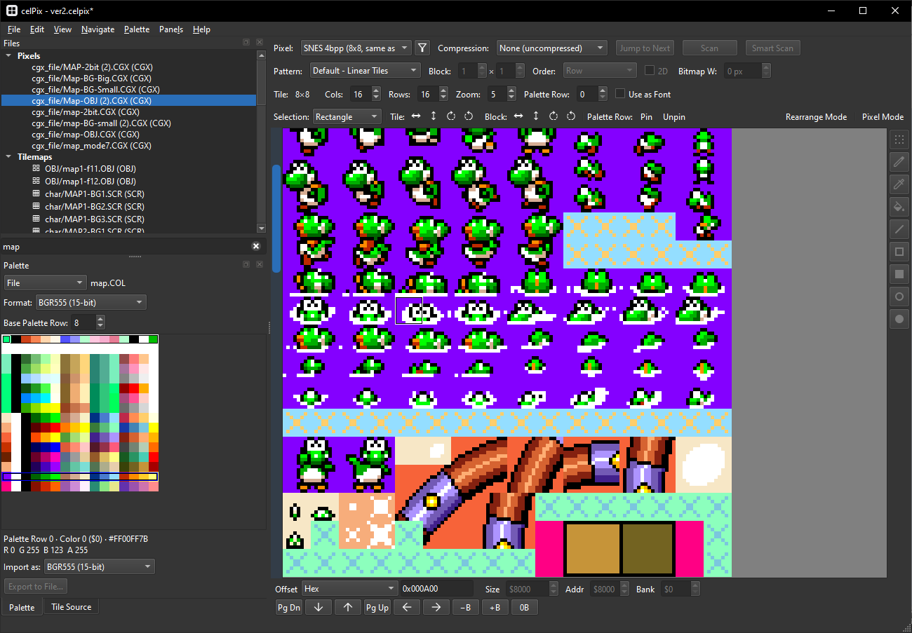
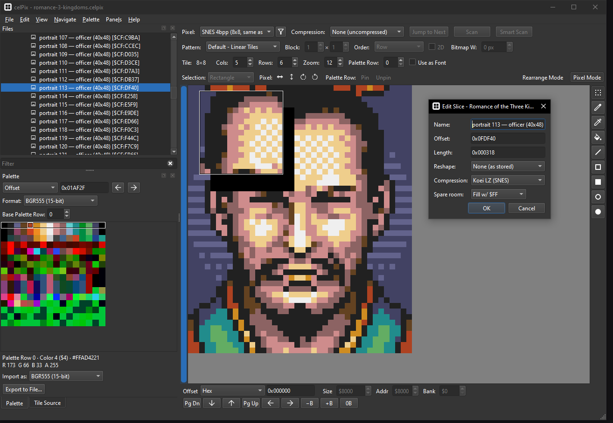
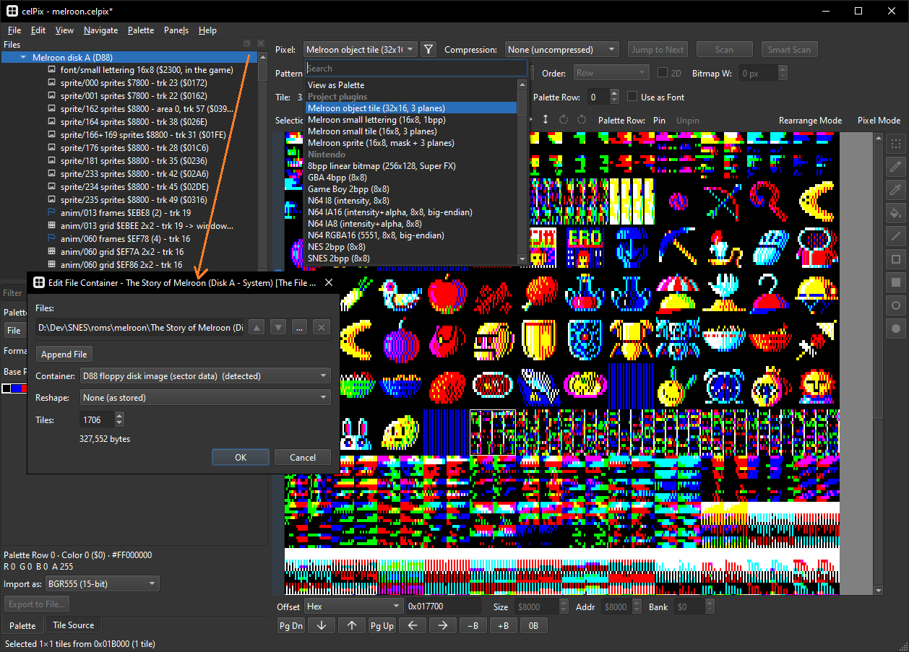
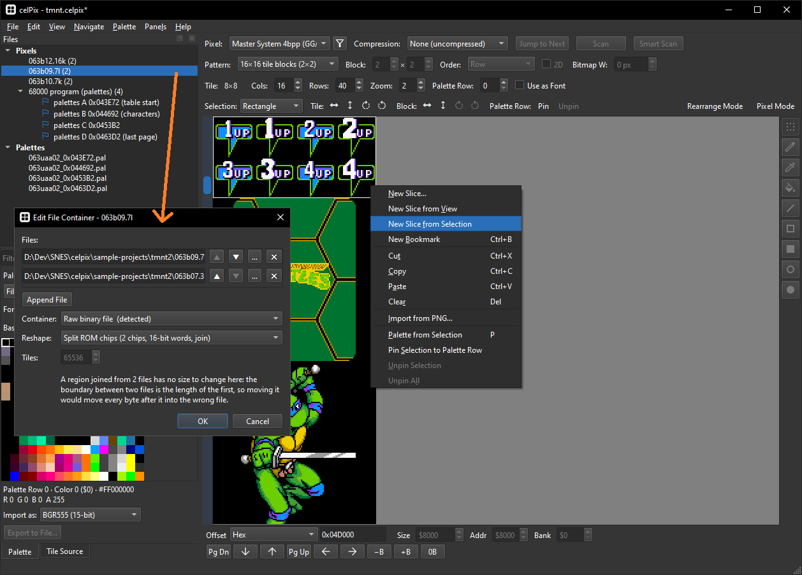

# celPix

**celPix** is a cross-platform graphics viewer and editor for romhacking and research.
It supports a variety of formats, including compression, and has a full plugin
system with examples to extend to custom and rarer formats.

If you run into issues or have questions. Submit a github issue or reach out to me
on Discord through the https://romhack.ing/ Discord server.

celPix is built on Python + Qt (PySide6) and runs on Windows, macOS, and Linux.

| | | |
|:-:|:-:|:-:|
|  |  |  |
| Pixel formats & editing | Tilemaps | Prototype & leak research |
|  |  |  |
| Slices & bookmarks | Fontmaps | Containers & reshaping |

## Features

- **Supported formats** - a wide variety of pixel and palette formats, covering
  the full set of formats supported by existing tools (YY-CHR, etc).
- **Compression** - SNES LZ1/LZ2/LZ16, Konami RLE, PackBits, LZSS, GBA/NDS BIOS
  LZ77, Sega's Nemesis/Enigma/Kosinski, SLZ16/SLZ24, PRS and PowerVR, with a
  decompressed preview overlay and support for editing decompressed pixel data.
- **Containers & Reshaping** - support for appending multiple files together and then a variety of byte "reshaping" plugins such as merging split ROM chips, deinterleaving, reversing bit order, etc
- **Editing** - full set of editing tools with undo/redo, copy/paste/etc internally
  and to external editors.
- **Tilemaps** - full set of tools for working with tilemaps and a plugin format to
  define how tile data is parsed. Uses a provided pixel source as a list of tiles
  that it indexes into.
- **Spritemaps** - a subtype of tilemaps that is used for rendering sprites and animations.
- **Fontmaps** - a subtype of tilemaps that reads and edits a ROM's strings,
  rendering them using a font bitmap for preview.
- **Import & export** - PNG import/export supporting both indexed and RGB.
- **Files, slices, and bookmarks** - edit multiple files at once, create bookmarks
  to quickly jump to different offsets and settings, create slices to work on
  individual graphics files out of a larger ROM file with saved settings.
- **Plugin system** - extensive plugin support for pixel formats, palette formats,
  compression, etc. Full custom python code and config file based for more
  templateable formats.
- **Projects** - session can be saved as a `.celpix` file and picked up later.

## Getting Started

### Install

Grab the build for your platform from the [Releases page](https://github.com/YoriKv/celpix/releases), unpack and run, no installer.

### First steps

1. **Open a file** - File -> Open pixel data, or drag a ROM/binary onto the window.
2. **Find the graphics** - pick a pixel format preset, then scroll, page through,
   or type in an offset.
3. **Pick the palette** - use the Palette panel to load a palette from an offset
   using an address or Palette from Selection (`P`), from a pal or CGRAM dump
   file, or from emulation state.
4. **Edit** - draw in tile or pixel mode, paste from an external image editor, or
   import a PNG.
5. **Write/Save** - write pixel and palette data back to the original file. Save
   your project session to resume later.

Help -> Shortcuts (`F1`) to view a list of keyboard shortcuts.

## Thank You

Thanks to the following projects that I used as reference for this tool, and for
the accumulated community knowledge this project represents. No code was copied
or used from these projects directly. Codecs were tested against these other
tools for accuracy where available.

- **[YY-CHR](https://www.romhacking.net/utilities/119/)**
- **[Tile Molester](https://github.com/toruzz/TileMolester)**
- **[MushROMs](https://github.com/bonimy/MushROMs)**
- **[CrystalTile2](https://www.romhacking.net/utilities/818/)**
- **[Advynia](https://github.com/KarisaAdvynia/Advynia)**
- **[DreamCompress](https://www.romhacking.net/utilities/1900/)**
- **[SuperFamiconv](https://github.com/Optiroc/SuperFamiconv)**
- **[Tile Layer Pro](https://www.romhacking.net/utilities/108/)**
- **[PSXSDK](https://github.com/nathanhi/psxsdk)**
- **[hcgcad](https://github.com/LuigiBlood/hcgcad)**
- **[MAME](https://github.com/mamedev/mame)**
- **[mdcomp](https://github.com/flamewing/mdcomp)**
- **[Beehive](https://github.com/BigEvilCorporation/Beehive)**
- **[mdtools](https://github.com/sikthehedgehog/mdtools)**

## AI Use Disclaimer

This tool was created with the help of an AI coding agent. All of the code and
some of the tooltips are AI generated, but the design and other aspects of this
project are my own.