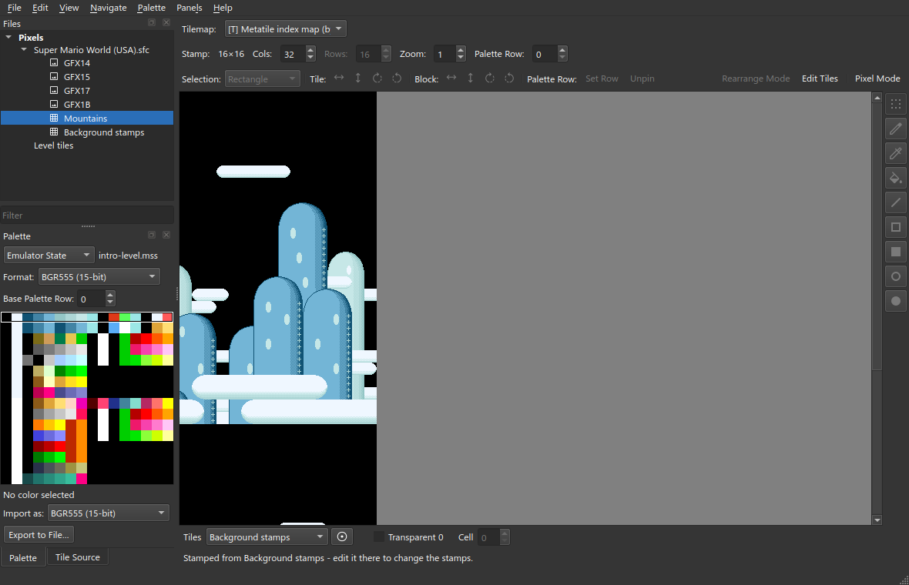
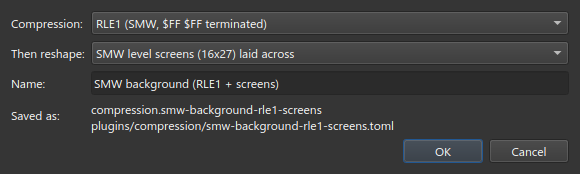
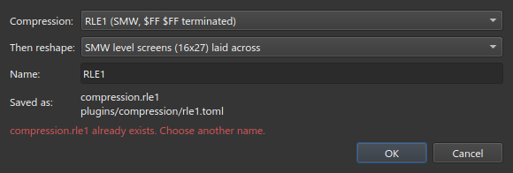
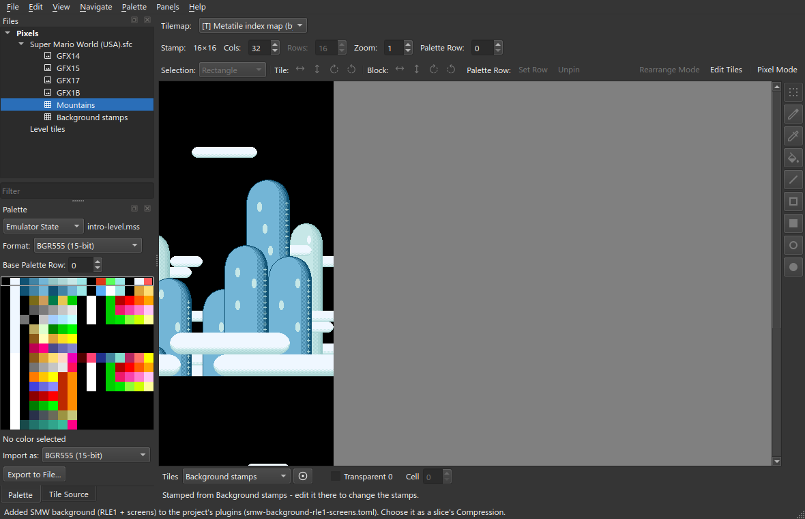
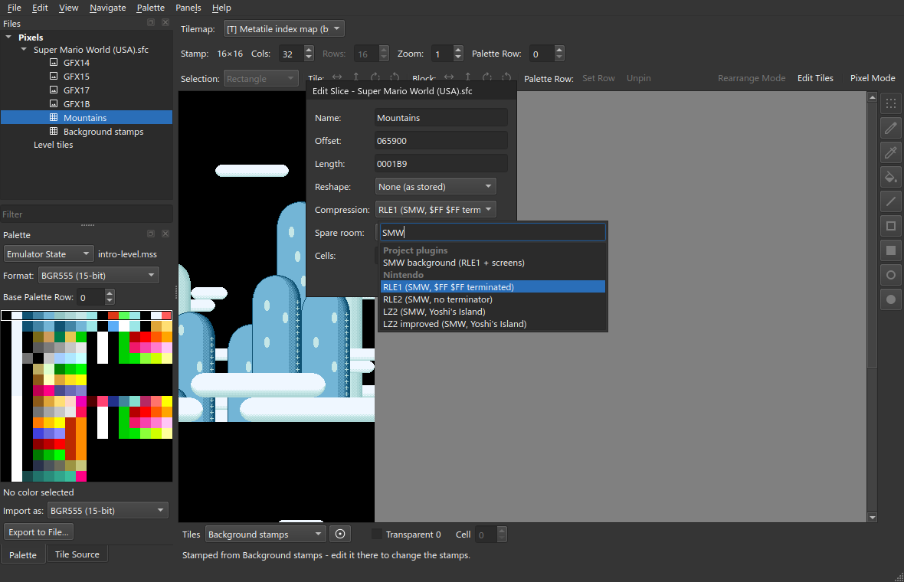
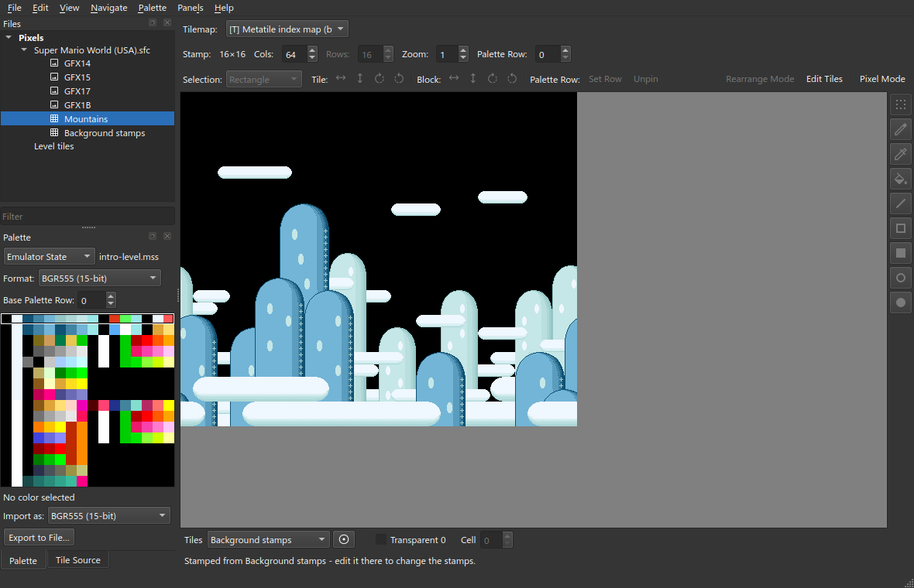

# Compress & Reshape

The **Reshape** setting of a slice runs *before* decompression. Some games unpack
data and *then* rearrange it. A **Compress & Reshape** plugin does the two steps
in that order.

Start from the project you made in [Getting Started](Getting-Started).

## 1. The problem

`Mountains` is an RLE1 stream. It has two screens of 16×27 stamps. The unpacked
data stores one screen after the other, so the right screen shows below the left
screen. In the game, the screens are side by side.



The reshape **SMW level screens (16x27) laid across** puts the screens side by
side. It is a project plugin: copy its code from [Plugin code](#plugin-code)
below into `plugins/reshape/smw_screens.py`, next to your `.celpix` file, and
reopen the project.

## 2. Make the pair

1. **File ▸ New Compress & Reshape Plugin…**. The project must be saved first.
   celPix puts the plugin in the `plugins/` folder.
2. Enter these values:

| | |
| --- | --- |
| **Compression** | RLE1 (SMW, $FF $FF terminated) |
| **Then reshape** | SMW level screens (16x27) laid across |
| **Name** | `SMW background (RLE1 + screens)` |



3. Click OK.

Each name must be unique. The name `RLE1` is refused, because a built-in scheme
already uses it:



The plugin is a data file. celPix loads it without asking for trust:

```toml
id = "compression.smw-background-rle1-screens"
name = "SMW background (RLE1 + screens)"
engine_id = "compression.compress-reshape"

[params]
compression = "compression.rle1"
reshape = "reshape.smw-screens-across"
```



## 3. Use it

1. Select `Mountains`.
2. Right-click ▸ **Edit…**.
3. Set **Compression** to the pair. It is under **Project plugins**.



4. Set **Cols** to 64.



When celPix loads the entry, it unpacks the data and then reshapes it. When it
writes the entry, it does the two steps in reverse. If the compression has
[inputs](Plugin-Inputs), you bind them on the pair.

## View-only pairs

celPix can write a pair only if both steps can be reversed. If one step cannot
be reversed, the dialog shows a warning before you click OK, and entries that
use the pair open view-only.

## Plugin code

<details>
<summary><code>plugins/reshape/smw_screens.py</code>: SMW level screens (16x27) laid across</summary>

```python
"""A level's Map16 buffer, walked into the picture it describes.

**The buffer is addressed in screens.** A level's Map16 tilemap is a run of 16x27
**screens** laid side by side — a ``$1B0`` screen stride
(``docs/smw/level-format.md``, "Screen base addresses"). Read straight through, a
two-screen background stacks its right half under its left. This lays every
screen the buffer holds across one row, so the cell grid is the picture.

It is a reshape because that is all it is: a length-preserving permutation of the
whole region, exactly reversible. It is *code* rather than a ``reshape.bitswap``
table because a screen is 27 rows — not a power of two — and an address-line
permutation can only express walks that are
(``docs/design/reshape-stage.md``). The overworld's Layer 1 has the same job over
16x16 pages, and that one *is* a table: ``smw-ow-map16-pages.toml`` beside this.

**It does not run in the Reshape slot.** That stage sits before decompression, so
there it would permute the packed stream. The Layer 2 backgrounds are RLE1
streams, so this is the second half of a **Compress & Reshape** pair —
``plugins/compression/smw-bg-tilemap.toml`` names the shipped RLE1 and this, and
the pair runs decompress -> reshape on load and unshape -> compress on save
(``docs/design/plugin-system.md``). A paged tilemap format could not take the job
instead: these maps are dense-stamped, one byte per 16x16 block, and a page
assembly states its width in cells, which would draw them at half size.
"""

from celpix.core.context import PipelineContext
from celpix.core.errors import Stage
from celpix.plugins import PluginInfo

SCREEN_COLUMNS, SCREEN_ROWS = 16, 27
SCREEN_CELLS = SCREEN_COLUMNS * SCREEN_ROWS  # $1B0


def _screens_across(size: int) -> list[int]:
    """``order[dest] = src`` for every whole screen in ``size`` bytes."""
    count = size // SCREEN_CELLS
    width = count * SCREEN_COLUMNS
    order = [0] * (count * SCREEN_CELLS)
    for s in range(count):
        for y in range(SCREEN_ROWS):
            for x in range(SCREEN_COLUMNS):
                order[y * width + s * SCREEN_COLUMNS + x] = (
                    s * SCREEN_CELLS + y * SCREEN_COLUMNS + x
                )
    return order


class SmwScreensAcross:
    info = PluginInfo(
        id="reshape.smw-screens-across",
        name="SMW level screens (16x27) laid across",
        stage=Stage.RESHAPE,
        category="Project",
    )

    def reshape(self, data: bytes, ctx: PipelineContext) -> bytes:
        order = _screens_across(len(data))
        out = bytearray(data)  # a partial trailing screen rides through in place
        for dest, src in enumerate(order):
            out[dest] = data[src]
        return bytes(out)

    def unshape(self, data: bytes, ctx: PipelineContext) -> bytes:
        order = _screens_across(len(data))
        out = bytearray(data)
        for dest, src in enumerate(order):
            out[src] = data[dest]
        return bytes(out)


def register(registry):
    registry.register(SmwScreensAcross())
```

</details>
