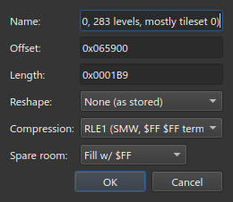
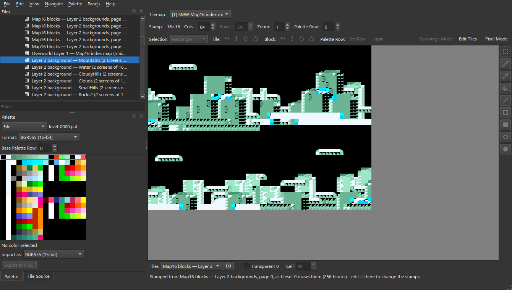
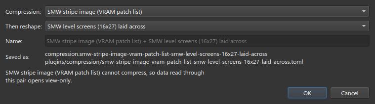

# Compress & Reshape

A slice's **Reshape** runs *before* decompression. For data the game unpacks
and *then* rearranges, a **Compress & Reshape** plugin runs them in that order.

Uses the Super Mario World sample project
([opening it](Plugin-Inputs#1-open-a-project-that-has-plugins)).

## 1. The problem

The Mountains Layer 2 background is an RLE1 stream: two screens of 16×27 blocks,
side by side.


The unpacked data is screen by screen, so RLE1 alone puts the right screen under
the left. Right-click ▸ **Edit…**, set **Compression** to **RLE1 (SMW, $FF $FF
terminated)**:





The reshape **SMW level screens (16x27) laid across** fixes this, but in the
**Reshape** row it would shuffle the packed bytes.

## 2. Make the pair

**File ▸ New Compress & Reshape Plugin…** (needs a saved project; the plugin goes
in `plugins/`).


| | |
| --- | --- |
| **Compression** | RLE1 (SMW, $FF $FF terminated) |
| **Then reshape** | SMW level screens (16x27) laid across |
| **Name** | `SMW background (RLE1 + screens)` |

Names must be unique:


The result is data only, so it loads without a trust prompt:

```toml
id = "compression.smw-background-rle1-screens"
name = "SMW background (RLE1 + screens)"
engine_id = "compression.compress-reshape"

[params]
compression = "compression.rle1"
reshape = "reshape.smw-screens-across"
```


## 3. Use it

**Edit…** the entry and pick the pair under **Project plugins**.


Load unpacks then reshapes; write inverts both. [Inputs](Plugin-Inputs) of the
compression half are bound on the pair.

## View-only pairs

A pair writes only if both halves are reversible. The dialog warns first:


