# Getting Started

Opening the overworld of **Super Mario World** (SNES,
`Super Mario World (USA).sfc`): a palette, four tile sheets and the map drawn
through them. Addresses are file offsets in hex; the ROM is headerless, so
`$04:A533` is file offset `$22533`.

> **Work on a copy of the ROM.** celPix writes into the ROM file in place and
> keeps no backup.

## 1. Open the ROM and save a project

celPix opens on an empty session.

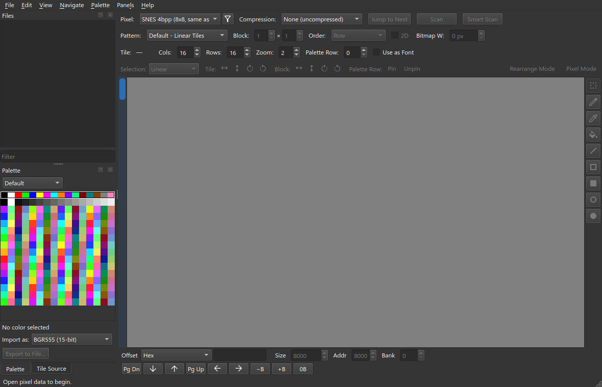

**File ▸ Open pixel data…**, then **File ▸ Save Project As…** (Ctrl+Shift+S) as
`smw.celpix` beside the ROM. A project stores references and settings, never
bytes.

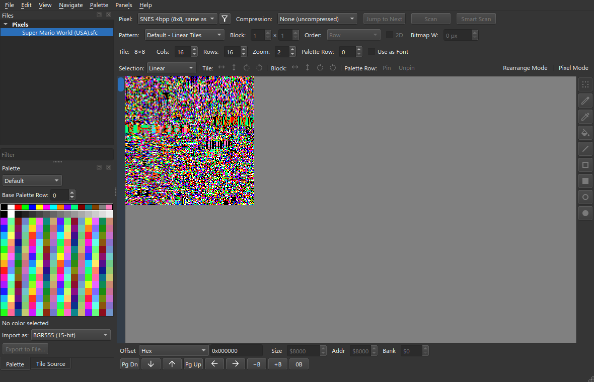

Every byte is read as SNES 4bpp tiles. Code and compressed data read as noise.

## 2. Find the graphics

This cartridge's tile sheets are compressed, 3 bits per pixel, back to back.
Type `$459F9` in the **Offset** box under the canvas and press Enter. On the top
toolbar set **Pixel** to **SNES 3bpp (8x8)**.

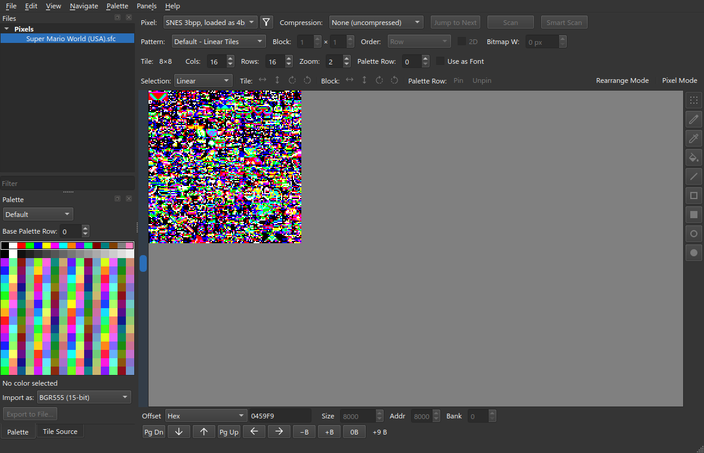

Set **Compression** to **LZ2 improved (SMW, Yoshi's Island)**. The canvas keeps
showing the file's own bytes; a **Decompressed view** window opens beside it with
what unpacks from this offset.

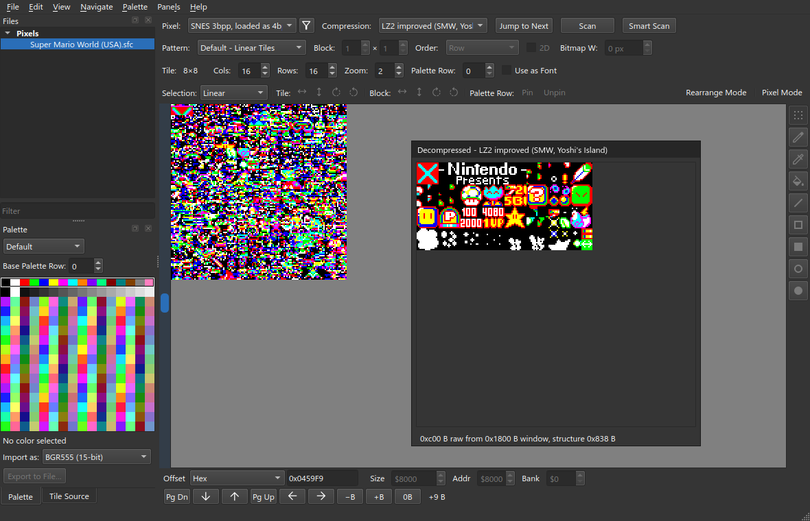

Its status line says how long the packed structure is: `structure 0x838 B`.

**Jump to Next** moves to the byte after the structure. The sheets are back to
back, so it walks them: `$459F9`, `$46231`, `$46CBB`…

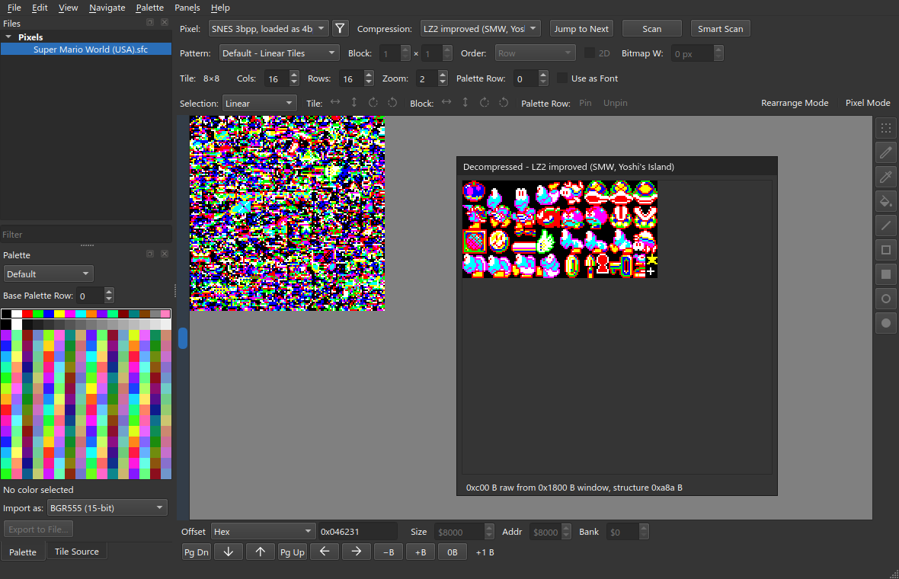

> **LZ2** and **LZ2 improved** unpack the same streams. They differ on the way
> back: the improved one packs about a tenth smaller than the game's own packer
> did. These sheets sit back to back with no room between them, so an edited
> sheet has to pack at least as small as it was — and under the plain scheme a
> few pixels are enough to make it a byte too long.

> **Scan** tries every byte and LZ2 unpacks almost anything, so here it stops on
> scraps. **Smart Scan** also asks whether the result looks like graphics, and
> from a real sheet it lands on the next one.

Go to `$5547E`: the first of the four sheets the overworld loads.

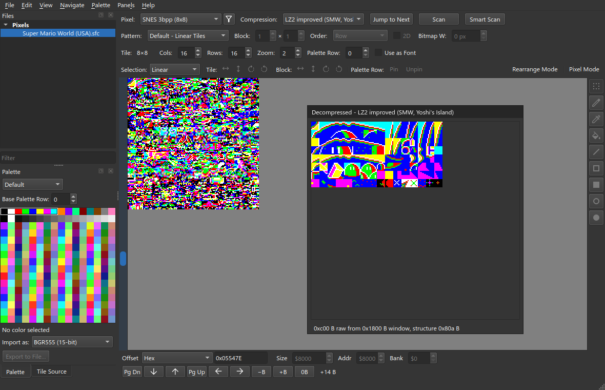

## 3. Take a palette from a save state

The game assembles its colours while it runs, so the ROM has no palette to load.
An emulator save state has the finished one. Make a state on the overworld in
Mesen or Snes9x.

In the **Palette** dock, change **Default** to **Emulator State** and pick the
file.

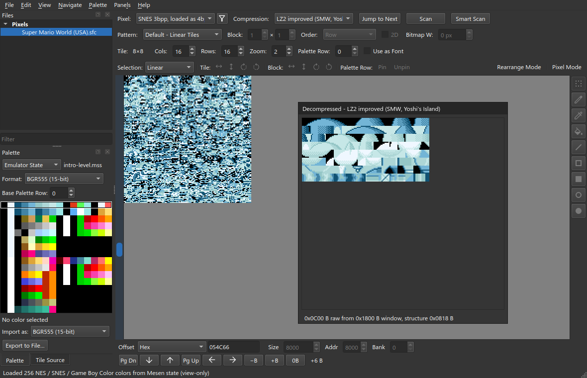

The grid is the console's 256 colours. A 3bpp tile reaches 8 of them at a time:
set **Palette Row** to 8, or click a swatch in the row you want.

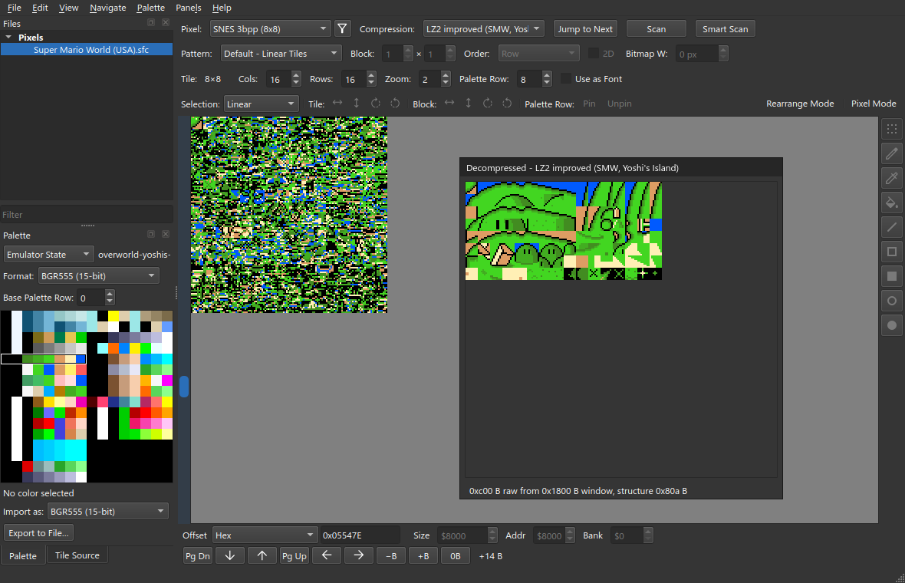

## 4. Carve the sheets as slices

A slice is a region of the file kept as its own entry.

**File ▸ New Slice from View** fills in the offset, the compression and the
length of the structure in view. Type the name: `GFX1C`.

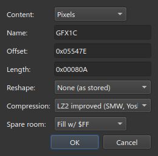

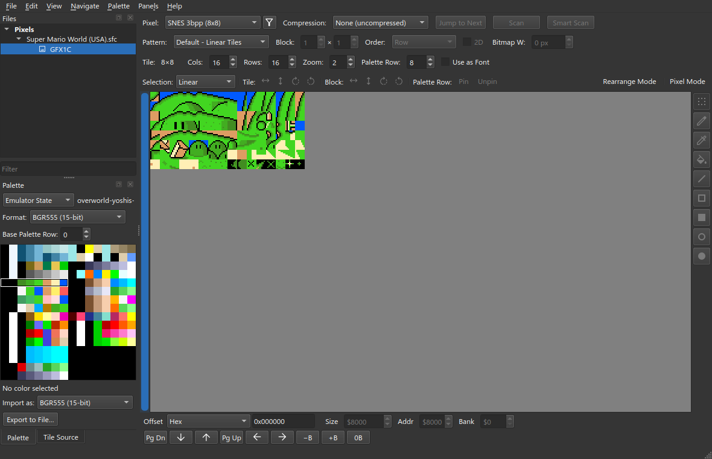

The other three: select the ROM in **Files**, **File ▸ New Slice…**, and set
**Compression** to LZ2 improved. **Length** may be left blank; the decompressor finds the
end.

| Name | Offset |
| --- | --- |
| `GFX1D` | `$55C88` |
| `GFX08` | `$4A657` |
| `GFX1E` | `$5667F` |

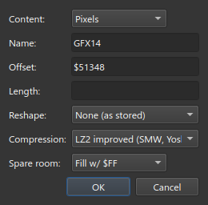

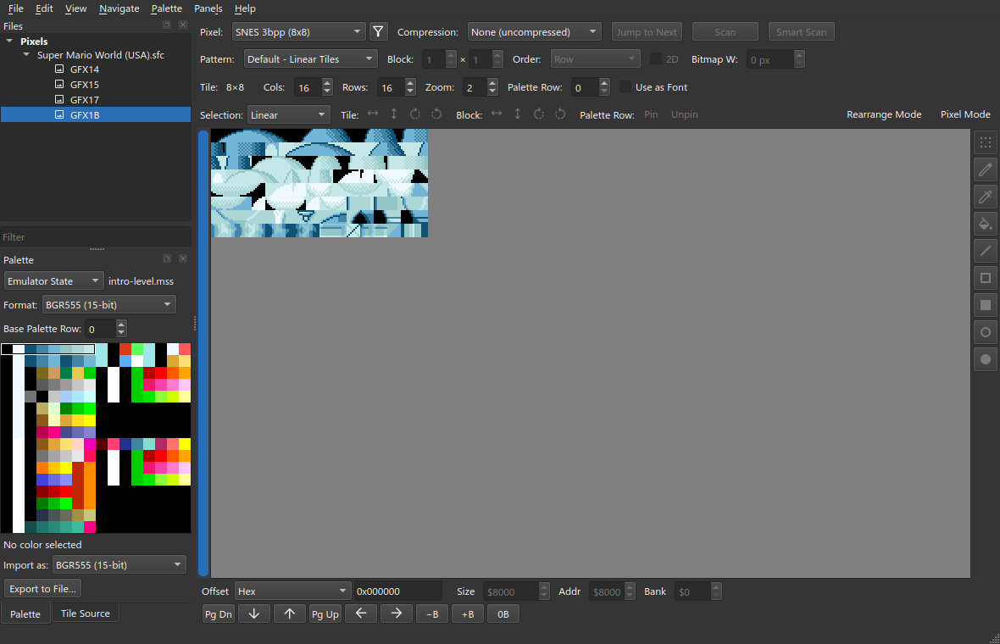

A slice opens unpacked, in the format, palette and row its file had.

## 5. Edit pixels

Open `GFX1C`. Set **Zoom** to 6 and press **Pixel Mode** (E). The tools on the
right arm: Select, Pencil, Eyedropper, Fill, Line, Rect, Ellipse (1–9).

Click a swatch in the Palette dock to choose the colour, then draw.

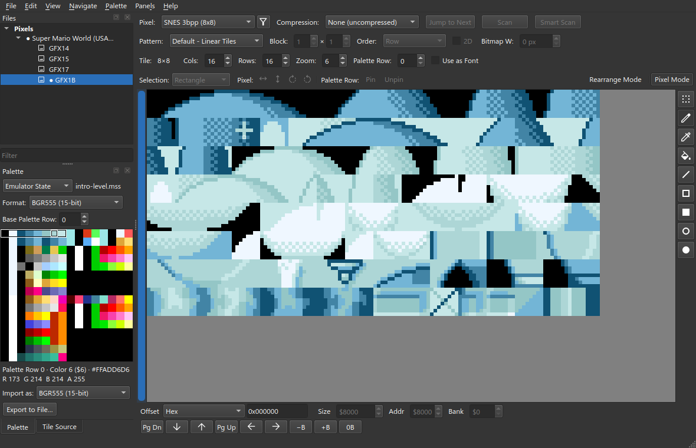

`●` marks unsaved bytes, on the slice and on the file that holds it. Each stroke
is one step of **Edit ▸ Undo** (Ctrl+Z).

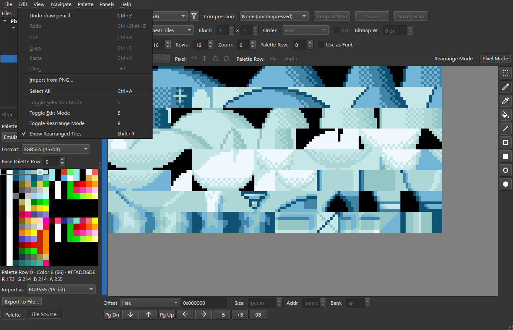

Press **Pixel Mode** again to leave it.

## 6. Assemble the tile window

The map names tiles by number, `$000`–`$1FF`, in the window of video memory the
four sheets are loaded into. A **composite** is that window: several entries laid
end to end as one tile source.

**File ▸ New Composite View…**. **Add source…** four times, in load order:
`GFX1C`, `GFX1D`, `GFX08`, `GFX1E`. Name it `Overworld tiles`.

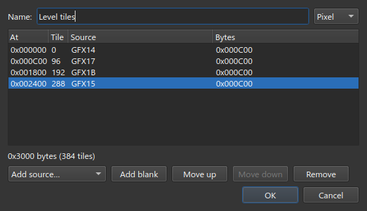

> The sizes read zero until the composite has been assembled once.

It opens on the default palette. Pick **Emulator State** and the state file
again, **Palette Row** 8, **Rows** 32.

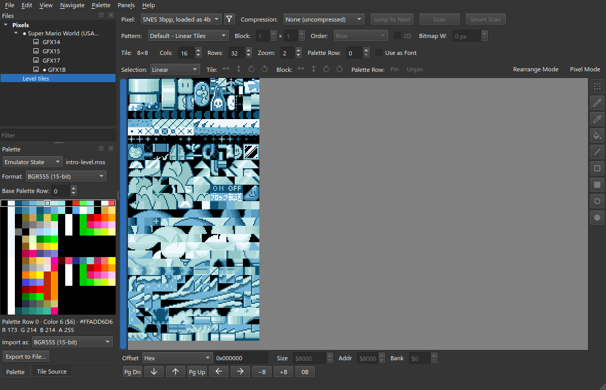

Right-click it ▸ **Edit…** shows where each sheet landed.

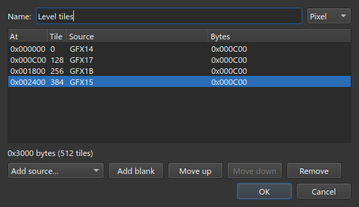

## 7. Carve the map

The overworld's tile numbers are one byte each, packed with RLE2 at `$22533`.
RLE2 has no end marker, so this slice needs its length.

Select the ROM. **File ▸ New Slice…**:

| | |
| --- | --- |
| **Content** | Tilemap |
| **Name** | `Overworld Layer 2` |
| **Offset** | `$22533` |
| **Length** | `$1AF8` |
| **Compression** | RLE2 (SMW, no terminator) |

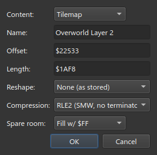

On the toolbar set **Tilemap** to **Tile map (8-bit index only)** and **Cols** to
32.

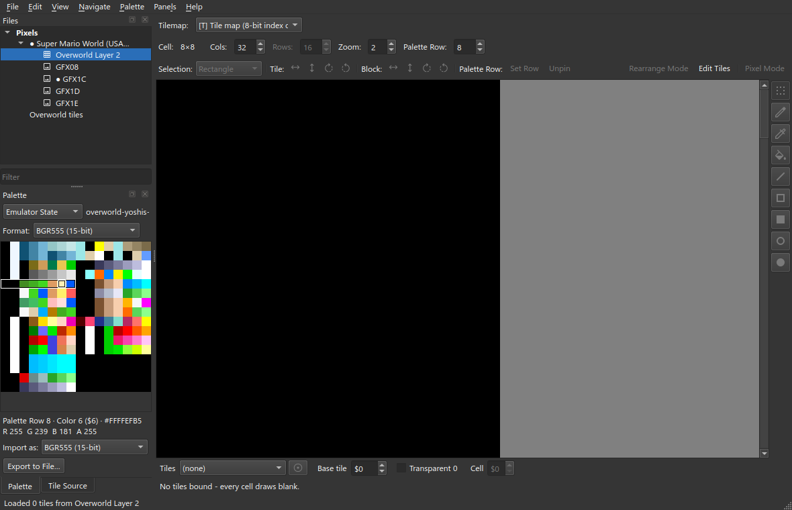

A map holds numbers, not art. In the bar under the canvas set **Tiles** to
`Overworld tiles`.

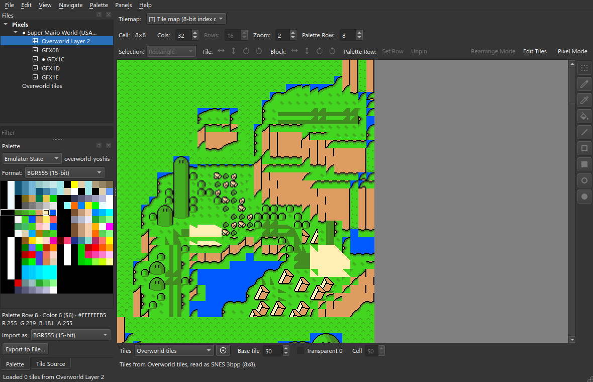

The map is eight pages of 32×32, one after another. The first is the top-left
quarter of the main map.

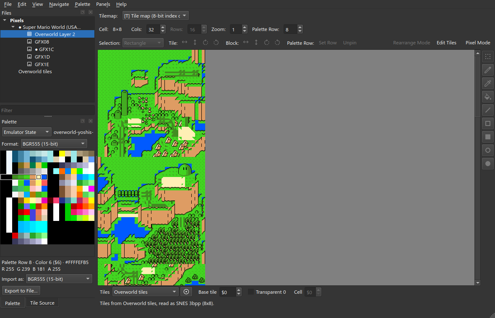

## 8. Edit the map

Press **Edit Tiles** (T) and open the **Tile Source** tab beside **Palette**.
Left-click picks a tile; right-drag picks a rectangle of them. Click on the map
to lay them down.

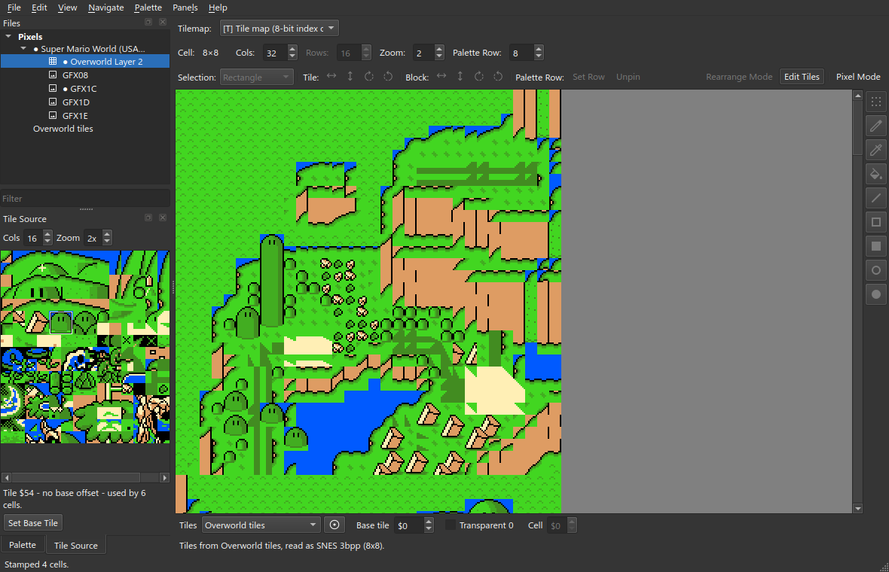

Right-click on the map picks up the tile under the pointer.

## 9. Write the ROM

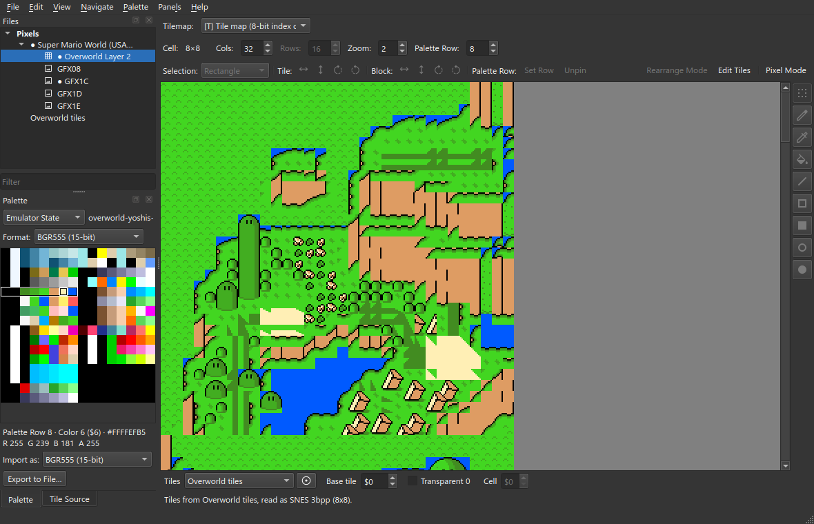

**File ▸ Write All** (Ctrl+Shift+W), then **File ▸ Save Project** (Ctrl+S).

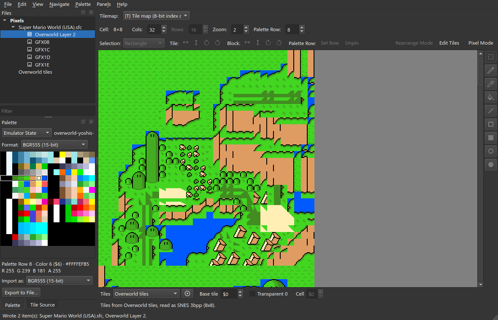

The sheet and the map are both re-packed on the way out, and each has to fit the
room its old stream had. The sheet does, with room to spare. A hill in the middle of the lake breaks one long run into three, and the
write is refused:

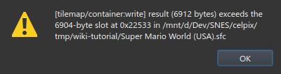

Undo it, or make room elsewhere in the map.

Test in an emulator.

## Where this goes

The same steps, carried through the whole cartridge, are every sheet, the window
each tileset loads, the block tables, the backgrounds and the text. The pages
beside this one take the parts that need more than a slice:

- [Text and Fonts](Text-and-Fonts) — the message boxes, read and typed as words.
- [VRAM Windows](VRAM-Windows) — composites with gaps, and with pieces cut out of
  other sheets.
- [Pinned Palette Rows](Pinned-Palette-Rows) — a sheet shown in several palette
  rows at once.
- [Plugin Inputs](Plugin-Inputs) — this map in its own colours. It draws in one
  row here because a byte per cell has no room for a palette; the cartridge keeps
  that in a second stream.
- [Compress & Reshape](Compress-and-Reshape) — maps the game rearranges after it
  unpacks them.
