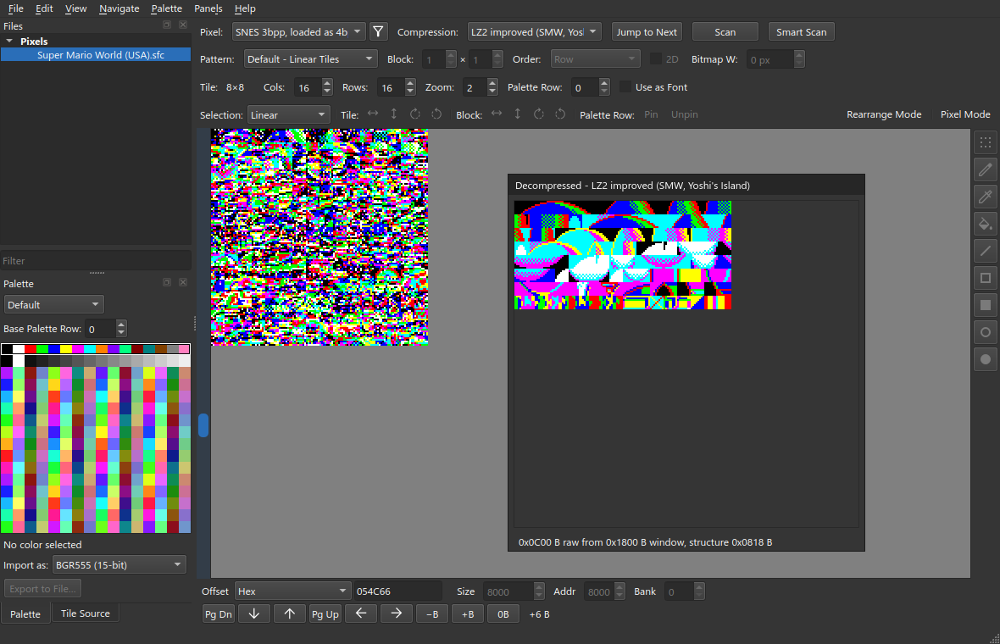
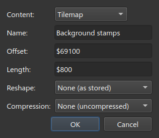
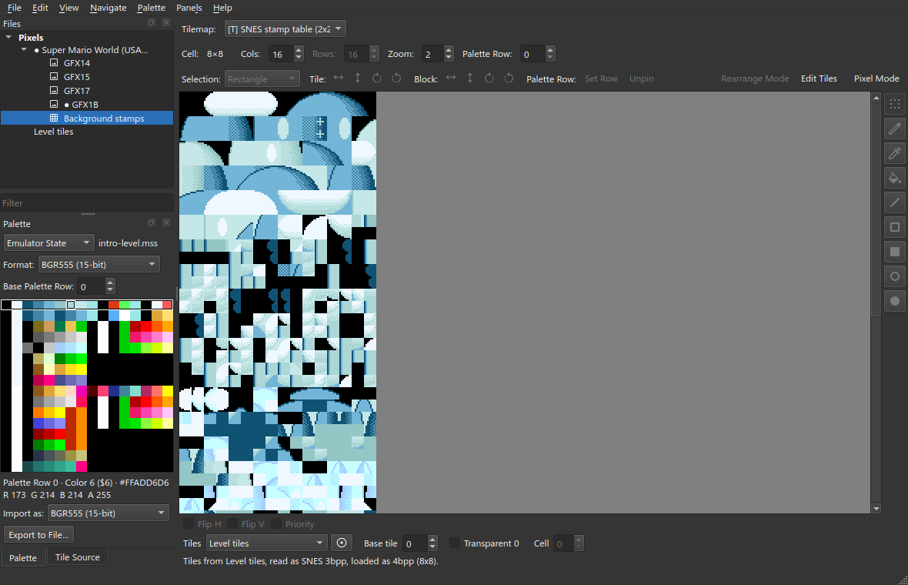
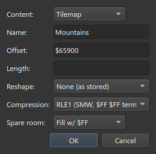
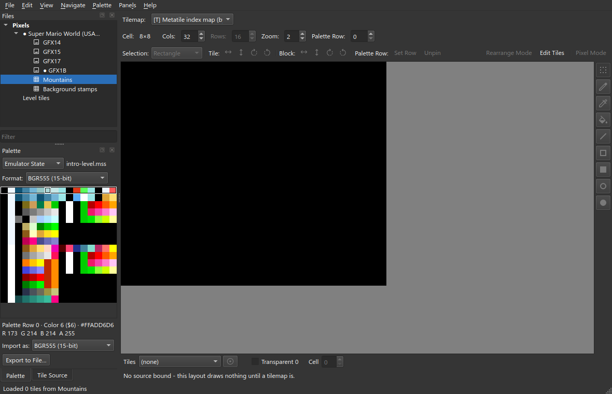
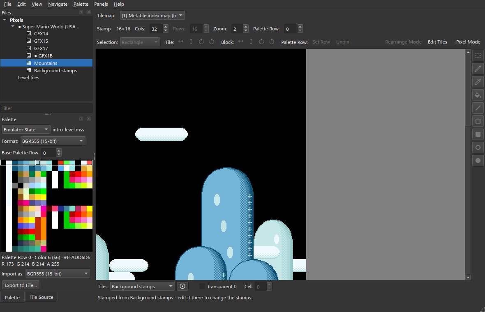
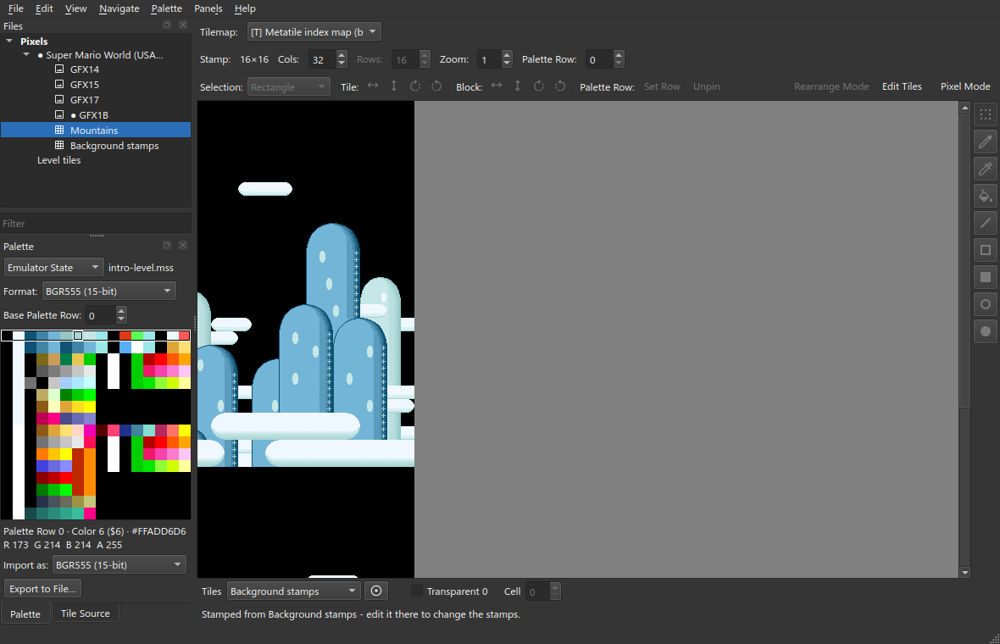
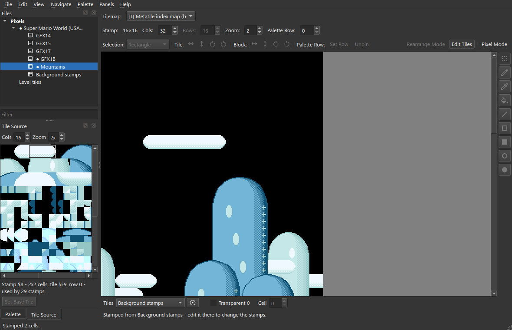
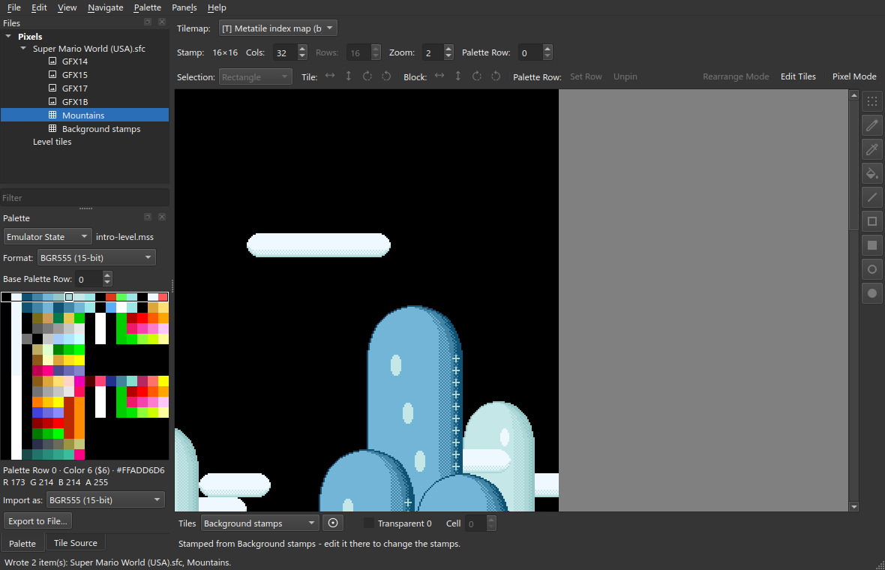
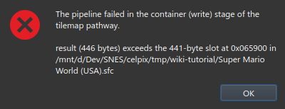

# Getting Started

An example project setup using `Super Mario World (USA).sfc`.

This tutorial edits the **Mountains** background in **Super Mario World**
(`Super Mario World (USA).sfc`). This is the background with tall spotted hills
in the intro level and in Yoshi's House.

You will set up:

- a palette
- four tile sheets
- a stamp table
- a map

All addresses are hex file offsets. The ROM has no header, so SNES address
`$0C:D900` is file offset `$65900`.

> **Use a copy of the ROM.** celPix writes to the file in place. It does not
> make a backup.

## 1. Open the ROM and save a project

1. **File ▸ Open pixel data…**, then open the ROM.
2. **File ▸ Save Project As…** (Ctrl+Shift+S). Save it as `smw.celpix`
   in the same folder as the ROM.

A project stores offsets and settings. It does not store a copy of the ROM
data.

## 2. Find the graphics

The tile sheets are 3bpp and compressed. They are stored one after another.

1. In **Offset** under the canvas, type `$459F9` and press Enter.
2. Set **Pixel** to **SNES 3bpp, loaded as 4bpp (8x8)**. The game expands these
   sheets to 4bpp when it loads them, so their palette rows are 16 colours.

3. Set **Compression** to **LZ2 improved (SMW, Yoshi's Island)**. The
   **Decompressed view** window shows the unpacked sheet.

The status line shows the packed size, for example `structure 0x838 B`.

4. Click **Jump to Next** to go to the next sheet. The sheets start at `$459F9`,
   `$46231`, `$46CBB`, and so on.

> **LZ2 improved** unpacks the same data as **LZ2**. It packs about 10% smaller.
> There is no free space between the sheets, so an edited sheet must not pack
> larger than the original.

> **Scan** stops at any data that LZ2 can unpack. **Smart Scan** also checks
> that the result looks like graphics.

5. Go to `$54C66`. This sheet has the hill graphics.

## 3. Take a palette from a save state

The game builds its palette while it runs. The ROM has no palette to read, so
take it from an emulator save state (Mesen or Snes9x).

1. In the emulator, start a new game. Make a save state in the first level
   after the file select screen (the intro level).
2. In the **Palette** dock, change **Default** to **Emulator State**.
3. Select the save state file.

The hills use palette row 0. Row 0 is selected by default.

## 4. Carve the sheets as slices

A slice is a region of the file that is saved as its own entry.

1. **File ▸ New Slice from View**. The offset, compression and length are
   filled in.
2. Name the slice `GFX1B` and click OK.

Make the other three slices:

1. Select the ROM in **Files**.
2. **File ▸ New Slice…**.
3. Enter the name and offset from the table.
4. Set **Compression** to **LZ2 improved**. Leave **Length** blank.

| Name | Offset |
| --- | --- |
| `GFX14` | `$51348` |
| `GFX17` | `$529B4` |
| `GFX15` | `$51AE8` |

## 5. Edit pixels

1. Open `GFX1B`.
2. Set **Zoom** to 6.
3. Click **Pixel Mode** (E).
4. Select a tool: Select, Pencil, Eyedropper, Fill, Line, Rectangle, Filled
   Rectangle, Ellipse or Filled Ellipse (keys 1 to 9).
5. Select a colour in the **Palette** dock and draw.

A `●` next to an entry means it has unsaved changes. **Edit ▸ Undo** (Ctrl+Z)
undoes one stroke.

## 6. Assemble the tile window

The background uses tile numbers `$000` to `$1FF`. These numbers point into the
area of video memory (VRAM) that the four sheets are loaded into. A
**composite** puts entries one after another to make that area.

1. **File ▸ New Composite View…**.
2. In **Add source…**, pick the sheets in this order: `GFX14`, `GFX17`,
   `GFX1B`, `GFX15`.
3. Name the composite `Level tiles` and click OK.

4. Set the palette to the save state again.
5. Set **Rows** to 32.

To see where each sheet is placed: right-click ▸ **Edit…**.

## 7. Carve the stamp table

The background is made of 16×16 **stamps**. Each stamp is four tilemap words.
Each word gives a tile number, a palette row and flip settings. The game calls
these Map16 blocks. The table has 256 stamps.

1. Select the ROM in **Files**.
2. **File ▸ New Slice…**, with these values:

| | |
| --- | --- |
| **Content** | Tilemap |
| **Name** | `Background stamps` |
| **Offset** | `$69100` |
| **Length** | `$800` |
| **Compression** | None (uncompressed) |

3. Set **Tilemap** to **SNES stamp table (2x2 words, down each column)**.
4. Under the canvas, set **Tiles** to `Level tiles`.

The four words of each stamp are stored in this order: upper-left, lower-left,
upper-right, lower-right. Because of this, the table looks like strips when you
view it directly. The map in the next step draws each stamp correctly.

## 8. Carve the map

The map has one byte per stamp. It is compressed with RLE1 at `$65900`. RLE1
data has an end marker, so leave **Length** blank.

1. Select the ROM in **Files**.
2. **File ▸ New Slice…**, with these values:

| | |
| --- | --- |
| **Content** | Tilemap |
| **Name** | `Mountains` |
| **Offset** | `$65900` |
| **Compression** | RLE1 (SMW, $FF $FF terminated) |

3. Set **Tilemap** to **Metatile index map (byte -> 2x2 record of a packed
   table)**.
4. Set **Cols** to 32.

5. Set **Tiles** to `Background stamps`.

The map has two screens. Each screen is 16×27 stamps. The second screen shows
below the first.

The cross you drew in step 5 shows on each hill edge that uses that tile.

## 9. Edit the map

1. Click **Edit Tiles** (T).
2. Open the **Tile Source** tab. It shows the stamps in the table.
   - Left-click selects one stamp.
   - Right-drag selects a range of stamps.
3. Click the map to place the selected stamps.

For example, right-drag from the middle of the cloud to its right end. Then
click the map two times at the right end of the first cloud. The cloud is now
longer.

Right-click the map to pick up the stamp under the pointer.

## 10. Write the ROM

1. **File ▸ Write All** (Ctrl+Shift+W).
2. **File ▸ Save Project** (Ctrl+S).

Each compressed entry must fit in its original space after it is packed again.
The longer cloud fits.

A new cloud in the empty sky does not fit. The sky is one long run of empty
stamps. A cloud in the middle of the run makes the packed data larger. celPix
refuses the write:

To fix this, undo the change, or remove data somewhere else in the map. Test
the ROM in an emulator.

The feature tutorials on [Home](Home) start from this project.
