# Pinned Palette Rows

A tile sheet of **Super Mario World** shown in several palette rows at once.

A sheet is rarely one row's worth of art. The pipe is drawn through row 5, the
coin through 6, the stone through 4, because the row comes from the map or the
sprite, never from the sheet. **Palette Row** is one choice for the whole view. A
**pin** says "these tiles draw through row *n*" whatever the view's row is.

A pin is display state. It moves no bytes and is saved in the project.

This page uses the Super Mario World sample project
([opening it](Plugin-Inputs#1-open-a-project-that-has-plugins)).

## 1. A pinned sheet

`GFX14`, as the project opens it. Every tile here was pinned from the game's own
block tables.

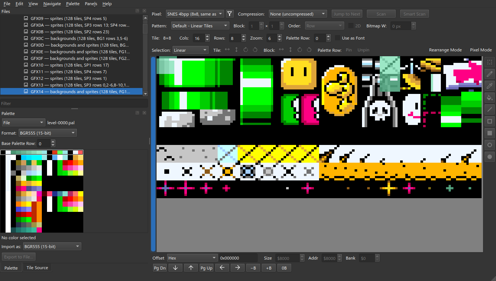

The **Palette** menu has the pins:

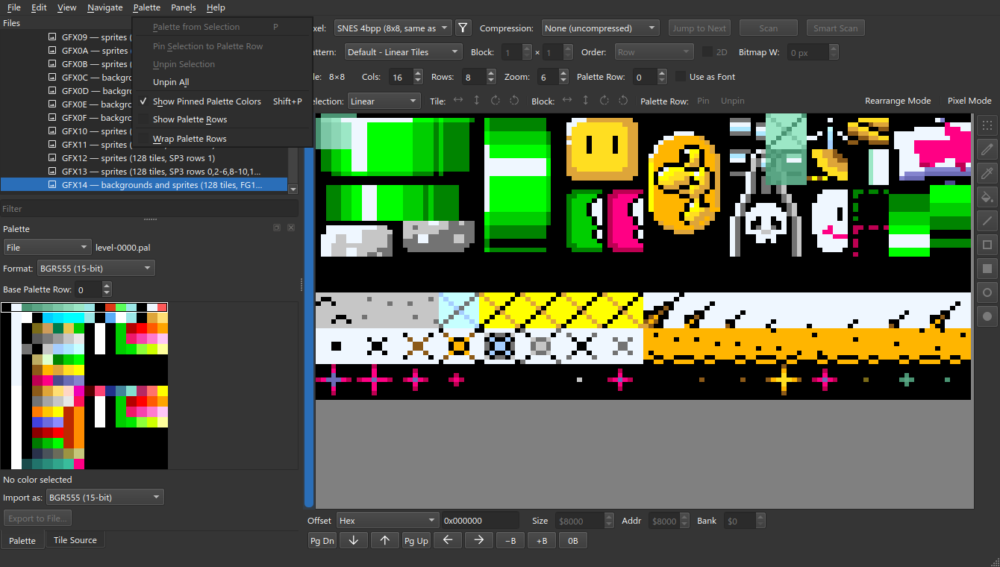

**Show Pinned Palette Colors** (Shift+P) off shows the sheet in the view's row
alone.

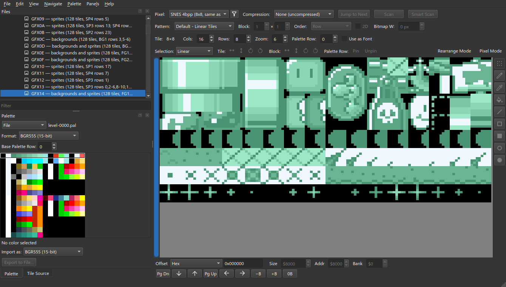

**Show Palette Rows** writes each pinned tile's row in its corner. A tile with no
number is not pinned.

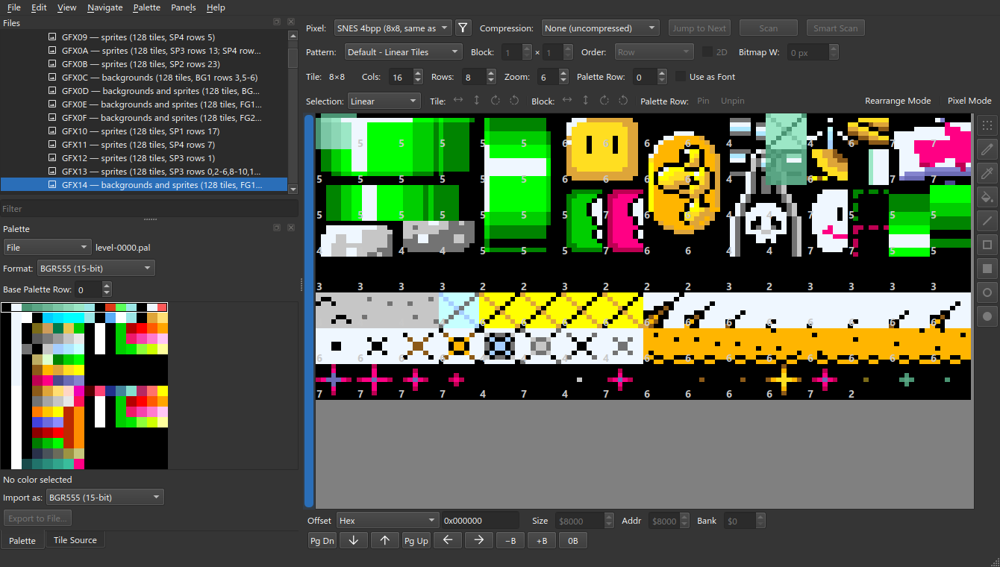

Both switches are yours, not the project's: they are remembered across projects.

## 2. Pin by hand

`GFX00`, the sprites, has no pins.

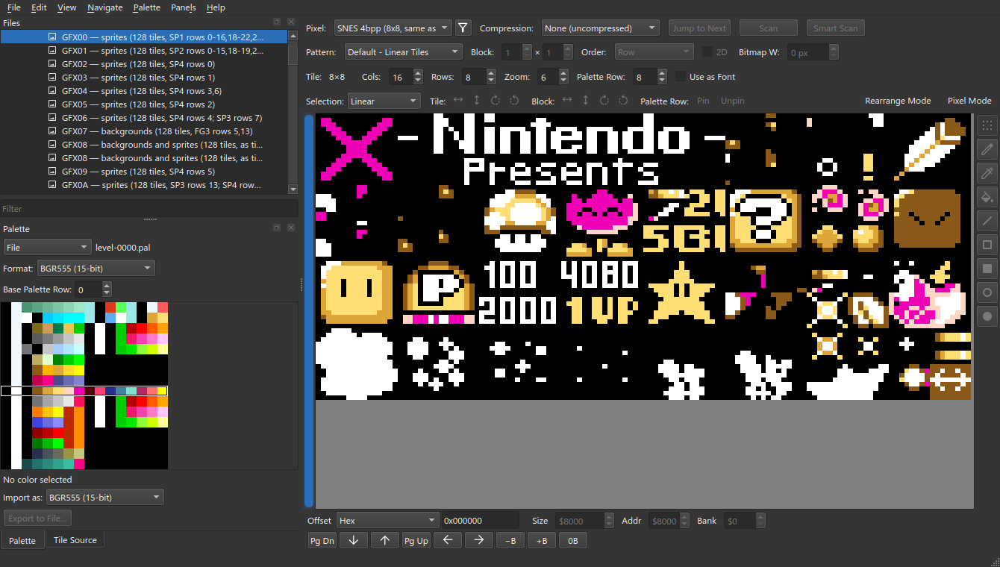

Set **Selection** to **Rectangle**. Set **Palette Row** to 11 — the whole sheet
changes — and drag over the P-switch.

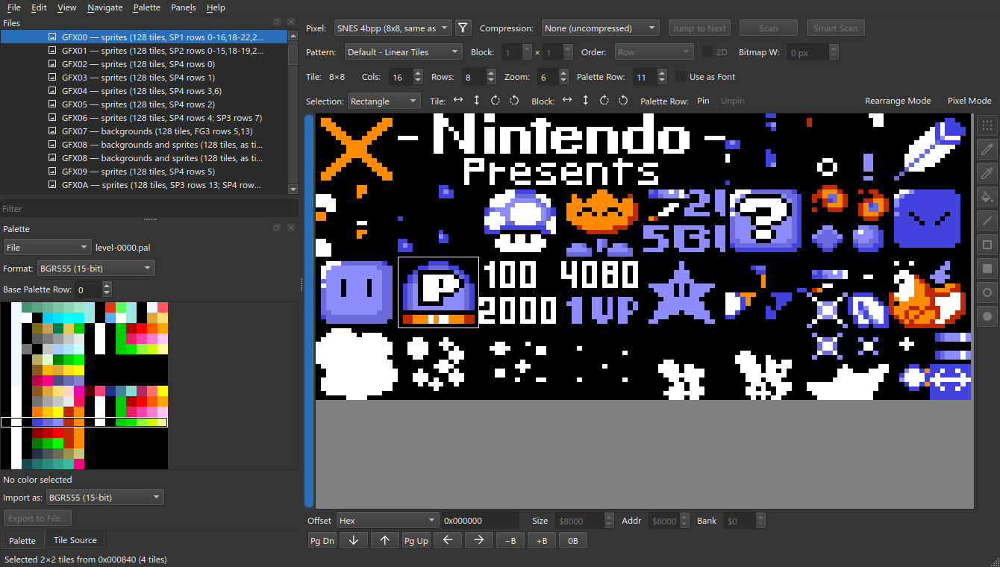

**Pin**, on the bar's **Palette Row** group. The same gesture is **Palette ▸ Pin
Selection to Palette Row**, and on the canvas's right-click menu.

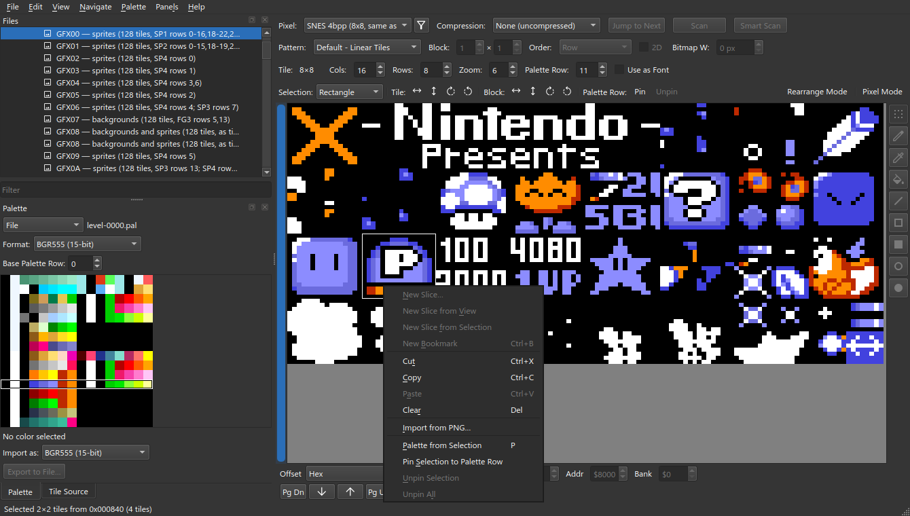

Set **Palette Row** back to 8. The P-switch stays in row 11.

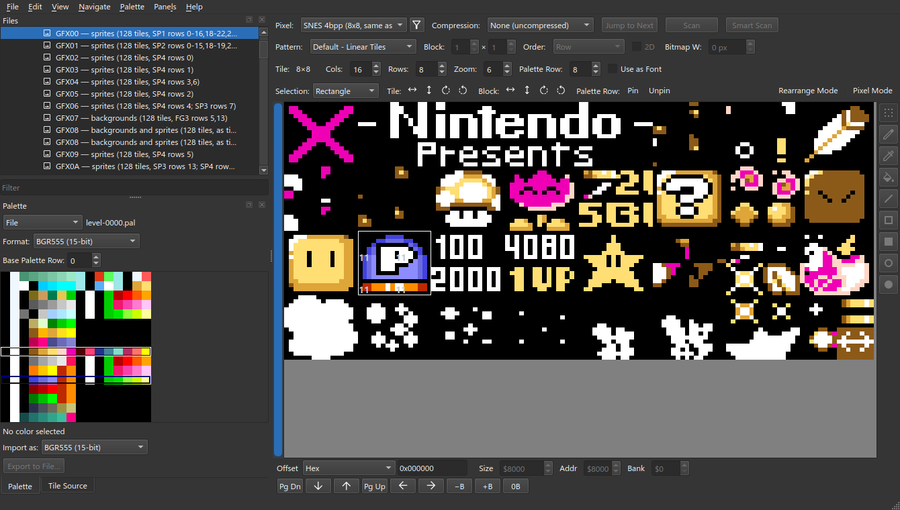

Pin the smiling block to row 10 the same way. In the palette, the white ring is
the view's row and the blue ring the selection's.

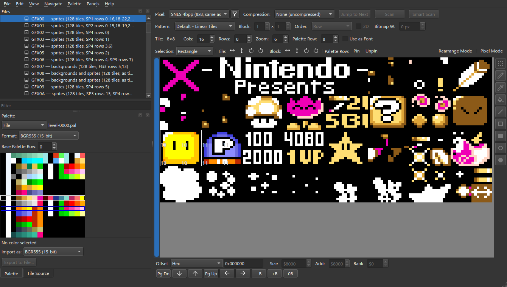

**Unpin** returns a selection to the view's row. **Palette ▸ Unpin All** drops
every pin and needs no selection. Each is one step of **Edit ▸ Undo**.

## 3. The base row

A pin is stored relative to **Base Palette Row** in the Palette dock. Move the
base from 0 to 1 and every pin moves with it; the unpinned tiles do not.

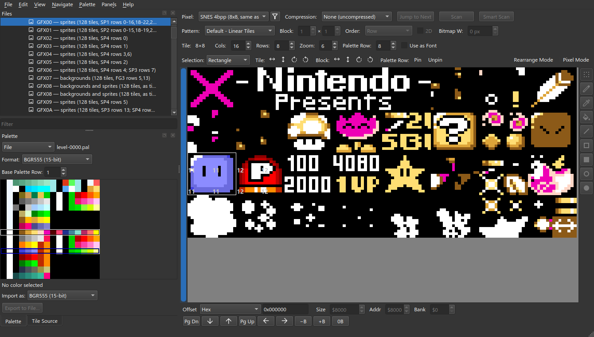

A sheet pinned against one palette is re-aimed at another with one spin.

## 4. On a tilemap

A map's cells carry their own row, so there is nothing to pin. The same button
reads **Set Row**, and writes the row into the selected cells.

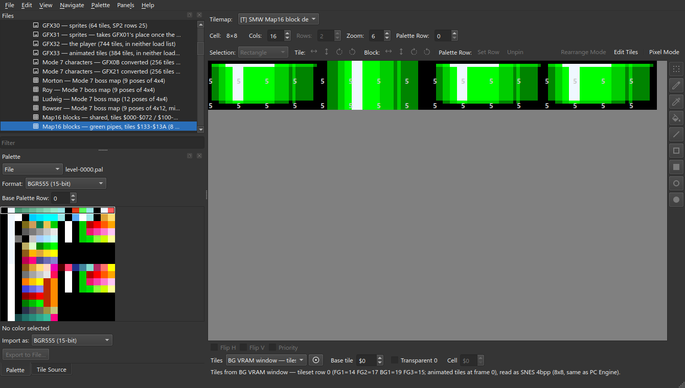

Set **Palette Row** to 6, select the first block, **Set Row**.

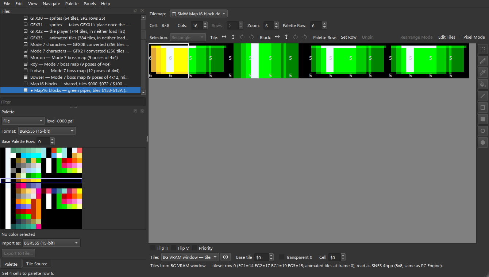

This one is an edit to the file: `●` on the entry and the ROM, and it is written
with **File ▸ Write**.

## In the project file

A pin is a run of pixels in the picture's own tile order, `[first pixel, count,
row]`. A tile is 64 pixels, so tile 64 starts at 4096.

```json
"palette_regions": [[4096, 128, 10], [4224, 128, 11], [5120, 128, 10], [5248, 128, 11]]
```
