# Plugin Inputs

Some formats need data from outside the slice. A plugin **declares** the inputs
it needs. The entry **binds** each input to a value.

This page uses the plugins of the Super Mario World sample project.

## 1. Open a project that has plugins

celPix loads the `plugins/` folder that is next to a `.celpix` file. To open the
project: **File ▸ Open Project…** (Ctrl+O).

- `.py` plugins are code. celPix asks before it runs each one. It asks again if
  the file changes.
- `.toml` presets are data. celPix does not ask.

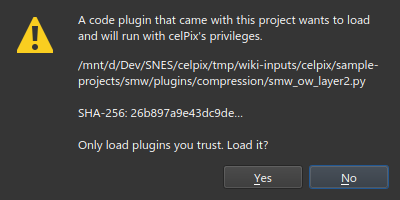

## 2. A region: the other half of a map

Each cell of the overworld map has attributes: flips, priority and palette. The
game stores these in a second RLE2 stream. The **SMW overworld Layer 2** plugin
unpacks the tile numbers. It takes the attribute stream as an input.

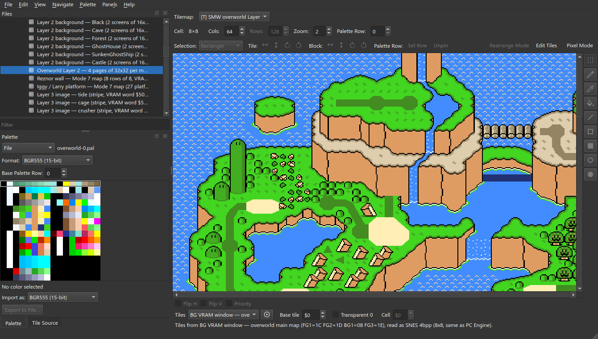

To see the inputs: **File ▸ Inputs…**, or right-click the entry. The
right-click menu also has **Copy Inputs** and **Paste Inputs**.

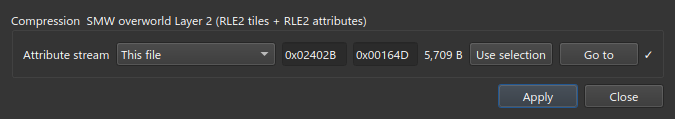

The **Attribute stream** is `$164D` bytes at `$2402B`.

- **Use selection** uses the selection on the canvas.
- **Go to** shows that region.
- `✓` means that the input is valid.

Click **Apply** to save the change.

### Binding it yourself

1. Select the ROM.
2. **File ▸ New Slice…**, with these values:

| | |
| --- | --- |
| **Content** | Tilemap |
| **Offset** | `$22533` |
| **Length** | `$1AF8` |
| **Compression** | SMW overworld Layer 2 (RLE2 tiles + RLE2 attributes) |

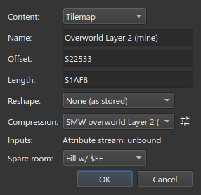

3. Click the inputs button.
4. Enter `$2402B` and `$164D`.
5. Click **Apply**, then **Close**.

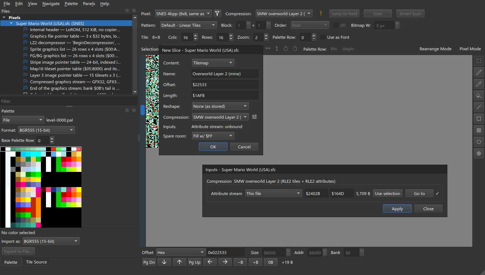

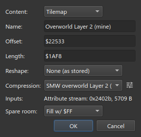

6. Set **Tilemap** to **SMW overworld Layer 2 (16-bit, 32x32 pages, 4 per
   map)**.
7. Set **Tiles** to the overworld main map BG VRAM window.
8. In **Files**, double-click the main map palette.
9. Set **Cols** to 64. Each map's four pages show as a square.

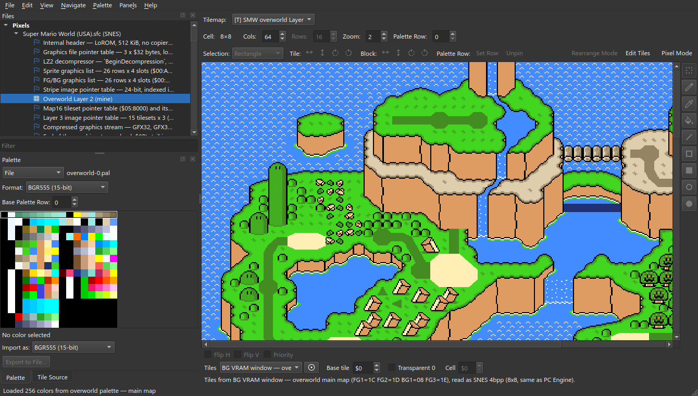

The binding is stored on the ROM entry. New slices with this compression use the
same binding.

### Left unbound

An entry with an unbound input shows its raw bytes. You cannot write it.
**Files** marks it with `!`. The tooltip tells you what to bind.

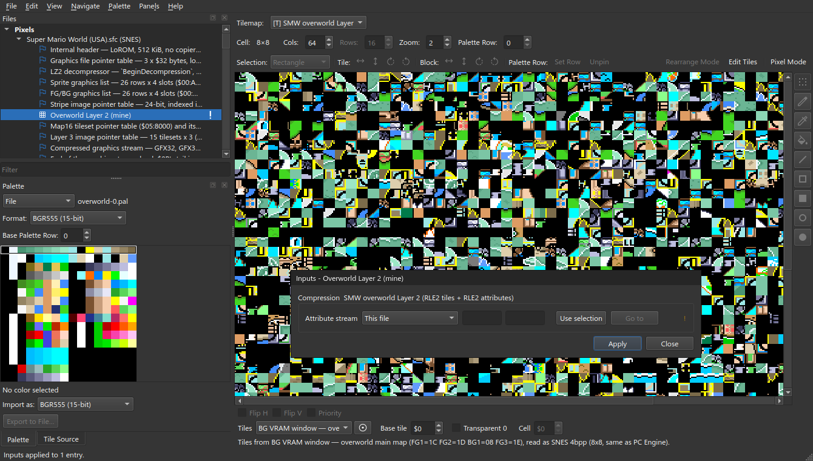

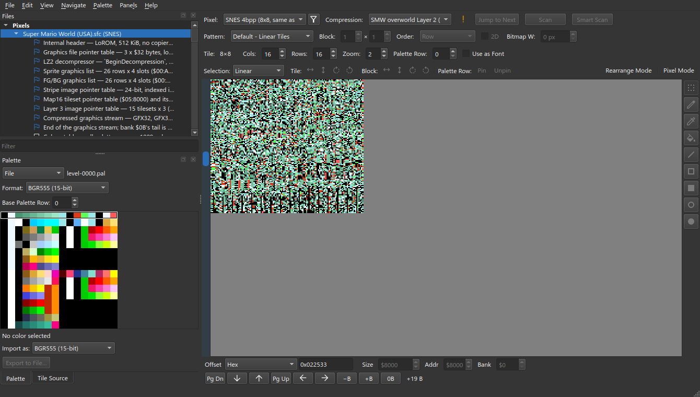

### What an edit cannot do

Inputs are read-only. **Flip H** changes the attribute stream, which is an
input. **File ▸ Write** (Ctrl+W) refuses the change:

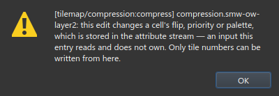

## 3. A flag: what the game's code knows

The game uploads some 3bpp sheets with the fourth bit plane set. These sheets
use colours 9 to 15. Only the game code shows which sheets. So the sheet plugin
takes flags as inputs. `GFX1E` sets one flag.

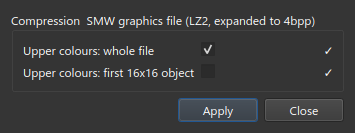

| Ticked | Unticked |
|:-:|:-:|
| [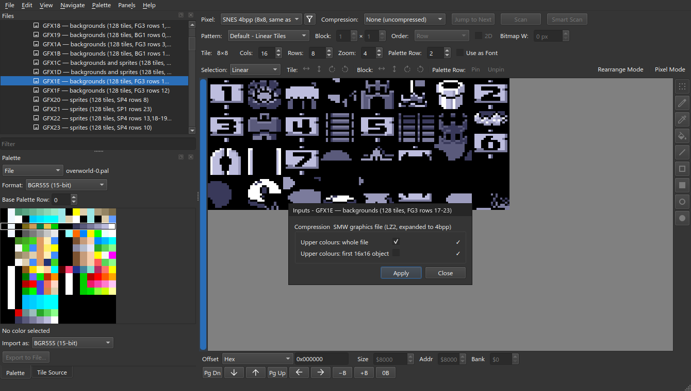](images/inputs-flag-on.png) | [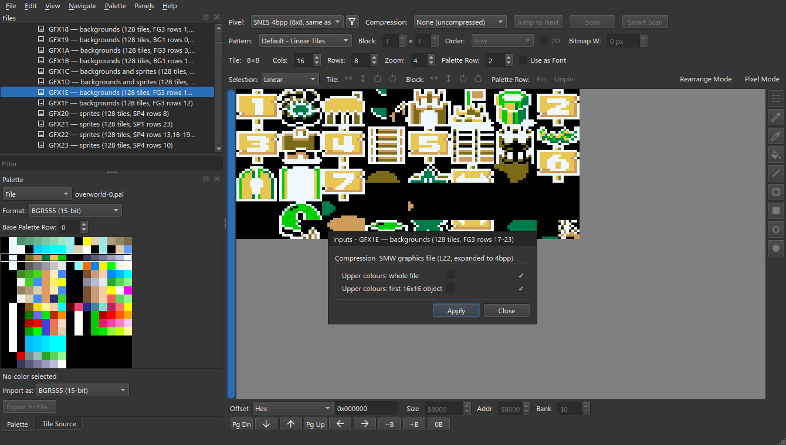](images/inputs-flag-off.png) |

The game uploads `GFX08` both ways. So it has two entries.

## 4. A number: one layer of two

A credits cast screen writes two layers from one stripe list. The stripe plugin
takes a **VRAM page** as an input. Two entries use the same bytes with different
pages. Each entry shows one layer.

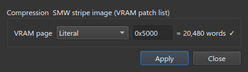

| `$5000`: the names | `$2000`: the mask |
|:-:|:-:|
| [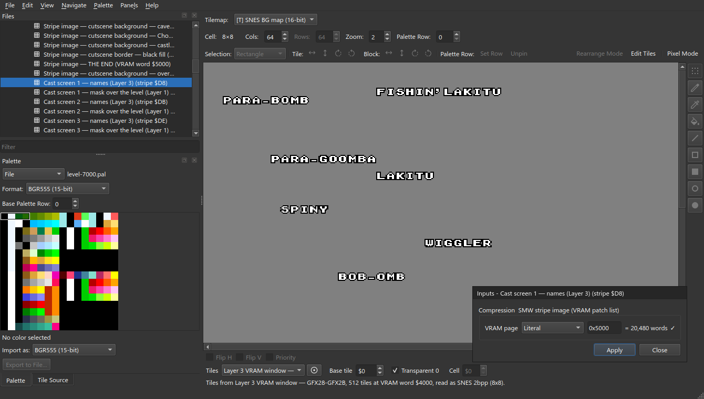](images/inputs-integer-names.png) | [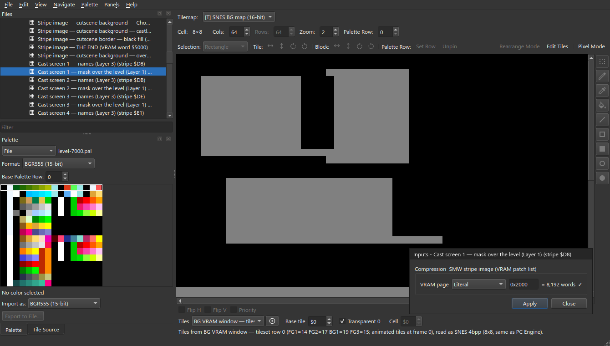](images/inputs-integer-mask.png) |

A number input can be:

- **Literal**: a value that you type.
- **From bytes**: a value read from another part of the file.

## Declaring one

```python
info = PluginInfo(
    id="compression.smw-ow-layer2",
    ...
    inputs=(InputSpec("attributes", "Attribute stream", InputKind.REGION),),
)

def decompress(self, data, ctx):
    attributes = ctx.get(KEY_INPUTS)["attributes"]
```

For a full example, see `compression/_inputs.py`. To open the folder: **File ▸
Open plugins folder…**.
