# Plugin Inputs

Some formats need data from outside the slice. A plugin **declares** the inputs
it needs. The entry **binds** each input to a value.

This page uses the plugins of the Super Mario World sample project.

## 1. Open a project that has plugins

celPix loads the `plugins/` folder that is next to a `.celpix` file. To open the
project: **File ▸ Open Project…** (Ctrl+O).

- `.py` plugins are code. celPix asks before it runs each one. It asks again if
  the file changes.
- `.toml` presets are data. celPix does not ask.

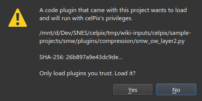

## 2. A region: the other half of a map

Each cell of the overworld map has attributes: flips, priority and palette. The
game stores these in a second RLE2 stream. The **SMW overworld Layer 2** plugin
unpacks the tile numbers. It takes the attribute stream as an input.

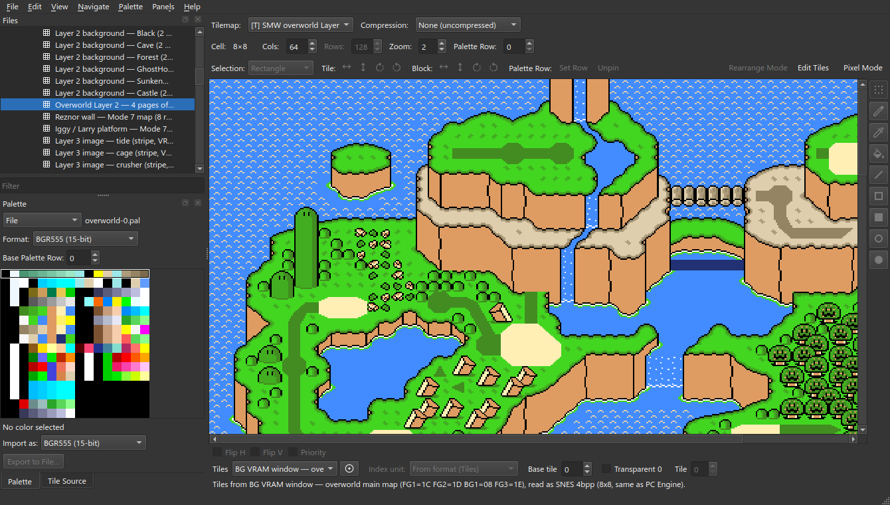

To see the inputs: **File ▸ Inputs…**, or right-click the entry. The
right-click menu also has **Copy Inputs** and **Paste Inputs**.

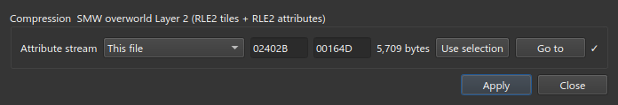

The **Attribute stream** is `$164D` bytes at `$2402B`.

- **Use selection** uses the selection on the canvas.
- **Go to** shows that region.
- `✓` means that the input is valid.

Click **Apply** to save the change.

### Binding it yourself

1. Select the ROM.
2. **File ▸ New Slice…**, with these values:

| | |
| --- | --- |
| **Content** | Tilemap |
| **Offset** | `$22533` |
| **Length** | `$1AF8` |
| **Compression** | SMW overworld Layer 2 (RLE2 tiles + RLE2 attributes) |

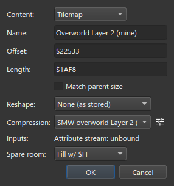

3. Click the inputs button.
4. Enter `$2402B` and `$164D`.
5. Click **Apply**, then **Close**.

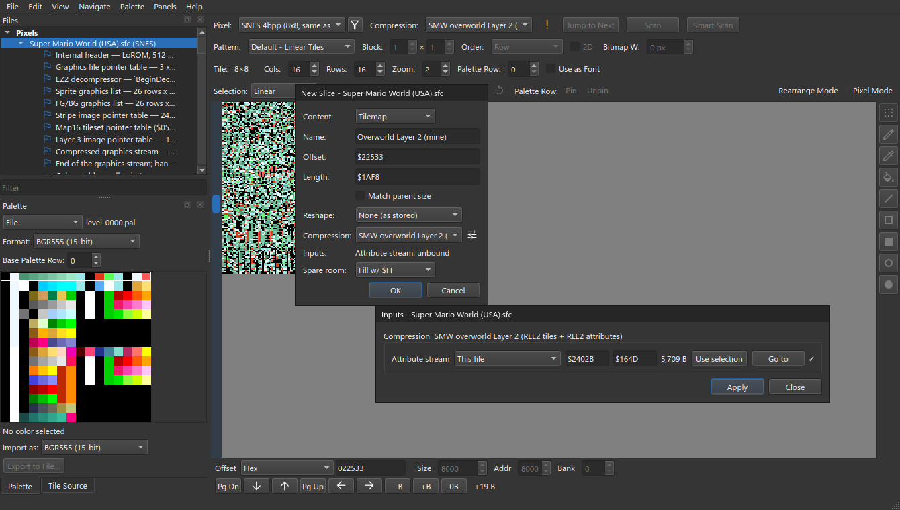

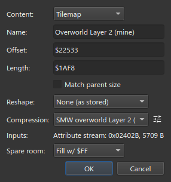

6. Set **Tilemap** to **SMW overworld Layer 2 (16-bit, 32x32 pages, 4 per
   map)**.
7. Set **Tiles** to the overworld main map BG VRAM window.
8. In **Files**, double-click the main map palette.
9. Set **Cols** to 64. Each map's four pages show as a square.

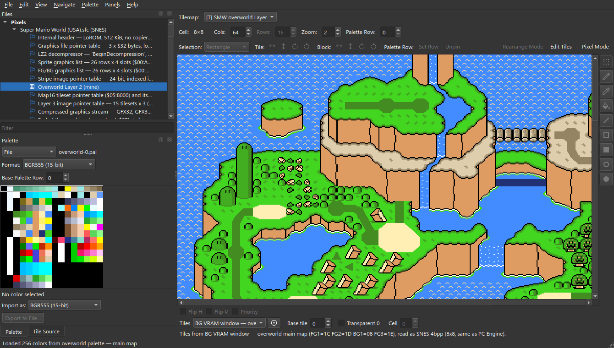

The binding is stored on the ROM entry. New slices with this compression use the
same binding.

### Left unbound

An entry with an unbound input shows its raw bytes. You cannot write it.
**Files** marks it with `!`. The tooltip tells you what to bind.

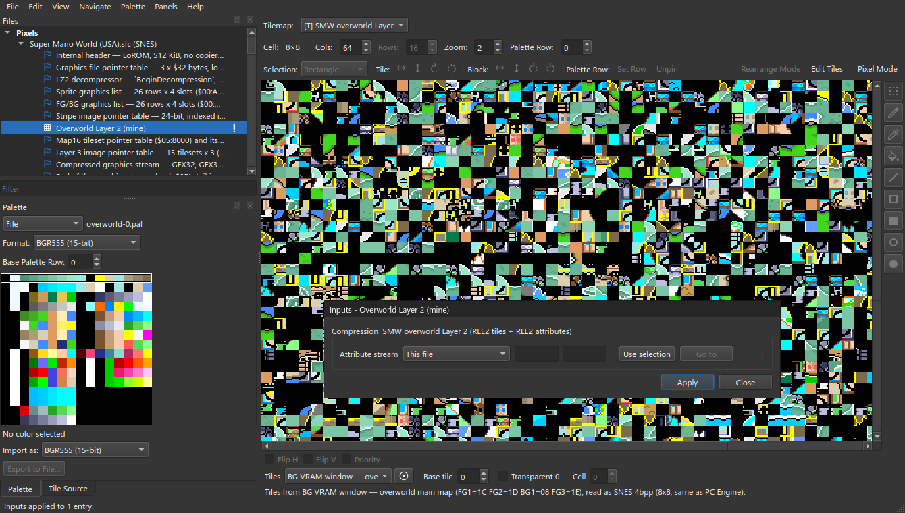

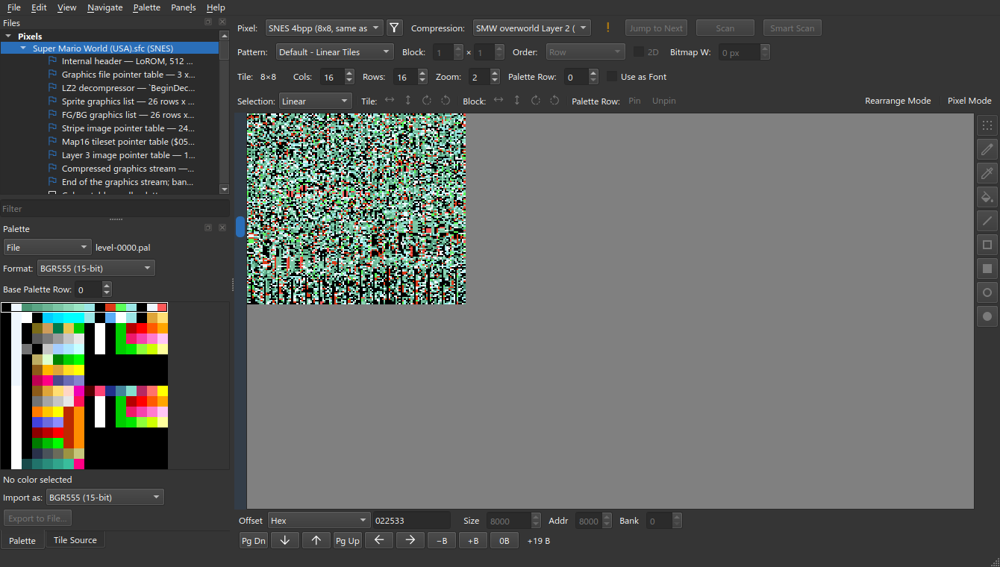

### What an edit cannot do

Inputs are read-only. **Flip H** changes the attribute stream, which is an
input. **File ▸ Write** (Ctrl+W) refuses the change:

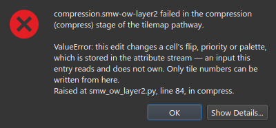

## 3. A flag: what the game's code knows

The game uploads some 3bpp sheets with the fourth bit plane set. These sheets
use colours 9 to 15. Only the game code shows which sheets. So the sheet plugin
takes flags as inputs. `GFX1E` sets one flag.

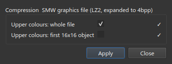

| Ticked | Unticked |
|:-:|:-:|
| [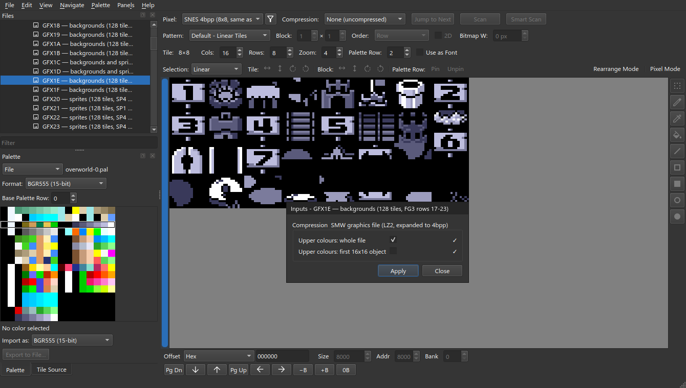](images/inputs-flag-on.png) | [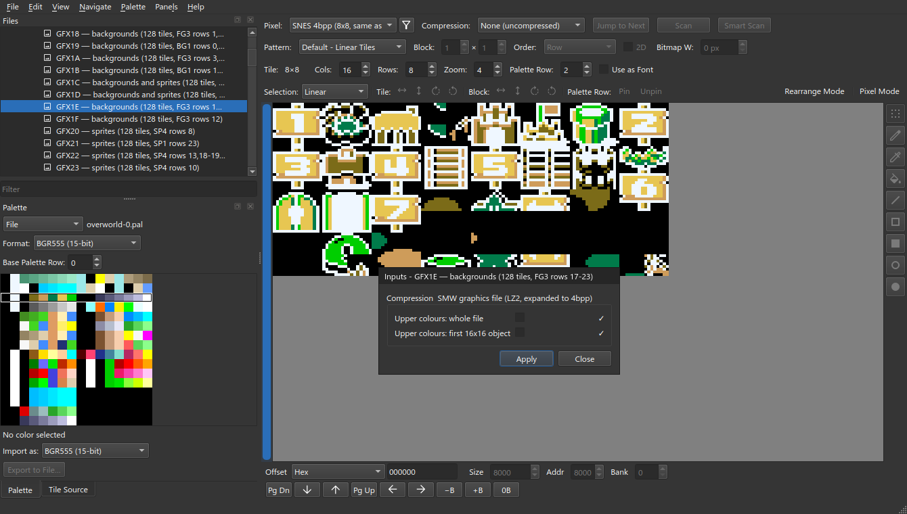](images/inputs-flag-off.png) |

The game uploads `GFX08` both ways. So it has two entries.

## 4. A number: one layer of two

A credits cast screen writes two layers from one stripe list. The stripe plugin
takes a **VRAM page** as an input. Two entries use the same bytes with different
pages. Each entry shows one layer.

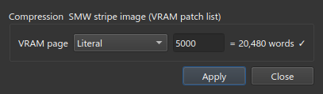

| `$5000`: the names | `$2000`: the mask |
|:-:|:-:|
| [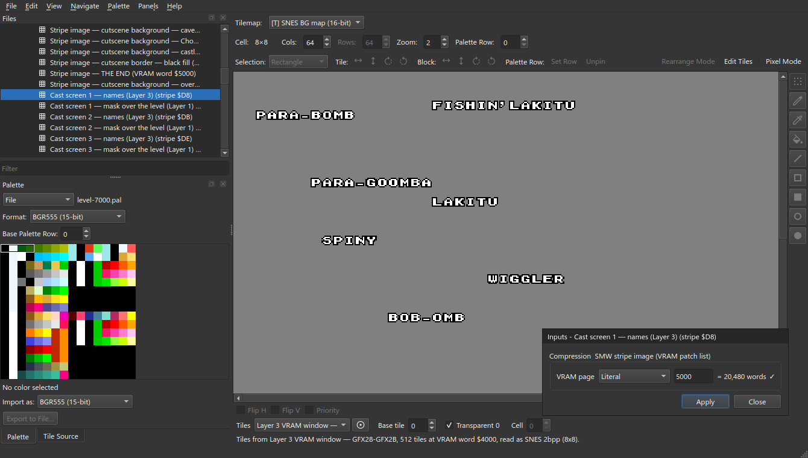](images/inputs-integer-names.png) | [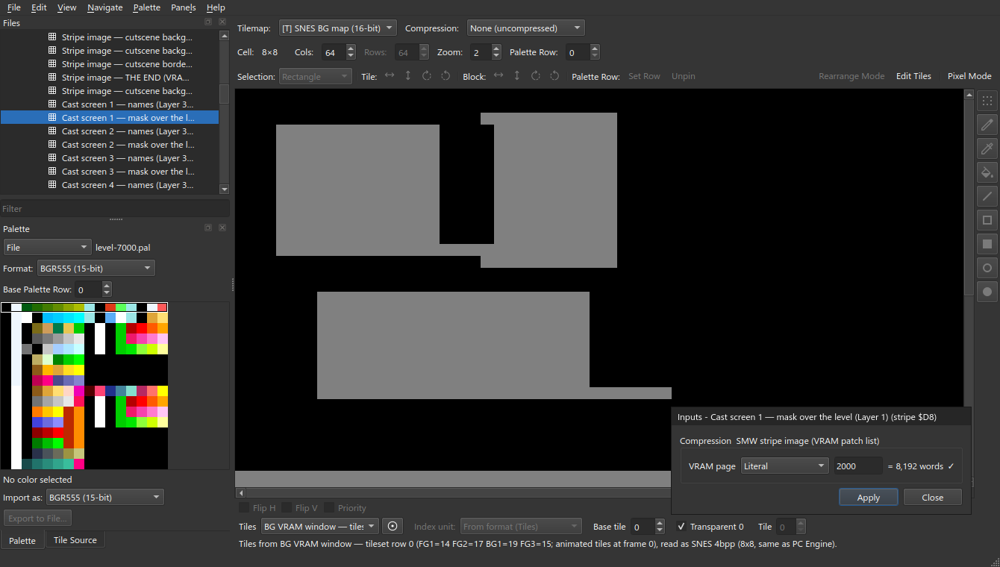](images/inputs-integer-mask.png) |

A number input can be:

- **Literal**: a value that you type.
- **From bytes**: a value read from another part of the file.

## Declaring one

```python
info = PluginInfo(
    id="compression.smw-ow-layer2",
    ...
    inputs=(InputSpec("attributes", "Attribute stream", InputKind.REGION),),
)

def decompress(self, data, ctx):
    attributes = ctx.get(KEY_INPUTS)["attributes"]
```

For a full example, see `compression/_inputs.py`. To open the folder: **File ▸
Open plugins folder…**.

## Plugin code

The sample project is not included with celPix. To follow this page with your
own project, copy these files into a `plugins/` folder next to your `.celpix`
file. Keep the subfolder names. Then reopen the project.

<details>
<summary><code>plugins/compression/smw_ow_layer2.py</code>: SMW overworld Layer 2 (RLE2 tiles + RLE2 attributes)</summary>

```python
"""The overworld's Layer 2: two RLE2 streams woven into one tilemap.

Each 16-bit tilemap word is split across two streams, each RLE2-compressed on
its own: the low bytes (tile numbers) and the high bytes (flips, priority,
palette). The entry is the tile-number stream; the attribute stream is bound as
the ``attributes`` input. Decoding unpacks both and interleaves them.

Inputs are read-only, so an edit that changes an attribute byte is refused and
only tile numbers are written back.
"""

from celpix.core.context import (
    KEY_COMPRESSED_SIZE,
    KEY_DECOMPRESS_COMPLETE,
    KEY_INPUTS,
    PipelineContext,
)
from celpix.core.errors import Stage
from celpix.plugins import InputKind, InputSpec, PluginInfo
from celpix.plugins.builtins.snes_rle import compress as rle_compress
from celpix.plugins.builtins.snes_rle import decompress as rle_decompress


def _attributes(ctx: PipelineContext) -> bytes:
    packed: bytes = (ctx.get(KEY_INPUTS) or {})["attributes"]
    out, _consumed, _complete = rle_decompress(packed, terminated=False)
    return out


class SmwOverworldLayer2:
    info = PluginInfo(
        id="compression.smw-ow-layer2",
        name="SMW overworld Layer 2 (RLE2 tiles + RLE2 attributes)",
        stage=Stage.COMPRESSION,
        # RLE2 has no end marker: the slice's length bounds the stream.
        self_delimiting=False,
        category="Project",
        inputs=(
            InputSpec(
                "attributes",
                "Attribute stream",
                InputKind.REGION,
                tooltip=(
                    "The RLE2 stream holding every tilemap word's high\n"
                    "byte: flips, priority, palette. It follows the tile\n"
                    "numbers in the ROM and unpacks to the same length."
                ),
            ),
        ),
    )

    def decompress(self, data: bytes, ctx: PipelineContext) -> bytes:
        tiles, consumed, _complete = rle_decompress(data, terminated=False)
        attributes = _attributes(ctx)
        if len(attributes) != len(tiles):
            raise ValueError(
                f"the attribute stream unpacks to {len(attributes)} bytes and the "
                f"tile numbers to {len(tiles)}; they are halves of the same words"
            )
        out = bytearray(len(tiles) * 2)
        out[0::2] = tiles
        out[1::2] = attributes
        ctx.set(KEY_COMPRESSED_SIZE, consumed)
        ctx.set(KEY_DECOMPRESS_COMPLETE, False)
        return bytes(out)

    def compress(self, data: bytes, ctx: PipelineContext) -> bytes:
        if bytes(data[1::2]) != _attributes(ctx):
            raise ValueError(
                "this edit changes a cell's flip, priority or palette, which is "
                "stored in the attribute stream — an input this entry reads and "
                "does not own. Only tile numbers can be written from here."
            )
        return rle_compress(bytes(data[0::2]), terminated=False)


def register(registry):
    registry.register(SmwOverworldLayer2())
```

</details>

<details>
<summary><code>plugins/tilemap/smw-ow-layer2.toml</code>: SMW overworld Layer 2 (16-bit, 32x32 pages, 4 per map)</summary>

```toml
# The overworld's Layer 2: 16-bit SNES background words in 32x32 pages, four
# pages per map, two maps back to back (the main map, then the submaps). The
# words come from `compression.smw-ow-layer2`, which rebuilds them from two RLE2
# streams. `page_counts` lets celPix lay the pages out as the SNES does; how many
# sit side by side is the entry's `view.pages_across`.
id = "preset.tilemap.smw-ow-layer2"
name = "SMW overworld Layer 2 (16-bit, 32x32 pages, 4 per map)"
engine_id = "codec.tilemap.packed"
category = "Project"

[params]
bytes = 2
endian = "little"
fields = "vhop ppii iiii iiii"
# One map is four pages; the file holds two maps.
page_columns = 32
page_rows = 32
page_counts = [4, 8]
```

</details>

<details>
<summary><code>plugins/compression/smw_gfx.py</code>: SMW graphics file (LZ2, expanded to 4bpp)</summary>

```python
"""A tile sheet as VRAM holds it: LZ2, then the 3bpp-to-4bpp expansion.

Sheets are stored 3bpp and uploaded 4bpp, 24 bytes to 32 per tile:

* bytes 0-15 (bitplanes 0 and 1, row-interleaved) are copied unchanged;
* bytes 16-23 (bitplane 2, one byte a row) become the bp2/bp3 pair, with bp3
  clear, or ``bp0 | bp1 | bp2`` in a masked tile.

Decoded to 4bpp, a tile reaches colours ``row * 16 + 1`` to ``+7`` of its
palette row, so one CGRAM palette is right for every sheet and every map drawn
through them. The expansion changes the length, so this is a Compression plugin
rather than a Reshape.

**The mask.** Some uploads set plane 3 on every drawn pixel, moving those tiles
into colours 9-15. The game code decides which, not the file, so two flag inputs
say it per entry: ``plane3_all`` for the whole file (GFX1E always, GFX08 under
tileset $11 and above) and ``plane3_head`` for tiles $00, $01, $10 and $11 (the
first 16x16 object of GFX01 and GFX17). Unbound, a flag is off.

Plane 3 is derived, so compressing drops it and re-encodes exactly. A pixel in a
colour its tile cannot store is refused with a message.
"""

from celpix.core.context import (
    KEY_COMPRESSED_SIZE,
    KEY_DECOMPRESS_COMPLETE,
    KEY_DECOMPRESS_PARTIAL,
    KEY_INPUTS,
    PipelineContext,
)
from celpix.core.errors import Stage
from celpix.plugins import InputKind, InputSpec, PluginInfo
from celpix.plugins.builtins.lz_command import compress as lz_compress
from celpix.plugins.builtins.lz_command import decompress as lz_decompress

# The USA release stores the LZ's back-reference offsets big-endian.
BIG_ENDIAN_OFFSETS = True

STORED_TILE = 24  # three bitplanes: two row-interleaved, one a byte a row
VRAM_TILE = 32  # four bitplanes as two interleaved pairs, 16 bytes apart
ROWS = 8


# The first 16x16 object of a sheet sixteen tiles wide.
HEAD_OBJECT = frozenset({0x00, 0x01, 0x10, 0x11})


def masked_tiles(ctx: PipelineContext, tiles: int) -> frozenset[int]:
    """The tiles this entry's flags say are uploaded with plane 3 set."""
    inputs = ctx.get(KEY_INPUTS) or {}
    if inputs.get("plane3_all"):
        return frozenset(range(tiles))
    return HEAD_OBJECT if inputs.get("plane3_head") else frozenset()


def expand(stored: bytes, masked: frozenset[int] = frozenset()) -> bytes:
    """3bpp planar to 4bpp planar, as the game uploads it.

    Plane 3 is clear, except in the ``masked`` tiles, where it is the OR of the
    other three: set on every pixel that is not transparent.
    """
    tiles = len(stored) // STORED_TILE
    out = bytearray(tiles * VRAM_TILE)
    for t in range(tiles):
        src, dst = t * STORED_TILE, t * VRAM_TILE
        out[dst : dst + 16] = stored[src : src + 16]  # bp0/bp1, unchanged
        for y in range(ROWS):
            bp2 = stored[src + 16 + y]
            out[dst + 16 + 2 * y] = bp2
            if t in masked:
                out[dst + 17 + 2 * y] = (
                    stored[src + 2 * y] | stored[src + 2 * y + 1] | bp2
                )
    return bytes(out)


def contract(vram: bytes) -> bytes:
    """The inverse: keep planes 0-2 and drop plane 3, which the game derives."""
    tiles = len(vram) // VRAM_TILE
    out = bytearray(tiles * STORED_TILE)
    for t in range(tiles):
        src, dst = t * VRAM_TILE, t * STORED_TILE
        out[dst : dst + 16] = vram[src : src + 16]
        for y in range(ROWS):
            out[dst + 16 + y] = vram[src + 16 + 2 * y]
    return bytes(out)


class SmwGraphicsFile:
    info = PluginInfo(
        id="compression.smw-gfx-vram",
        name="SMW graphics file (LZ2, expanded to 4bpp)",
        stage=Stage.COMPRESSION,
        self_delimiting=True,
        category="Project",
        inputs=(
            InputSpec(
                "plane3_all",
                "Upper colours: whole file",
                InputKind.FLAG,
                required=False,
                tooltip=(
                    "The uploader sets plane 3 on every drawn pixel, so\n"
                    "the file reaches colours 9-15 of its row. GFX1E always;\n"
                    "GFX08 under tileset $11 and above."
                ),
            ),
            InputSpec(
                "plane3_head",
                "Upper colours: first 16x16 object",
                InputKind.FLAG,
                required=False,
                tooltip=(
                    "The same, for tiles $00, $01, $10 and $11 alone —\n"
                    "the object at the head of GFX01 and GFX17."
                ),
            ),
        ),
    )

    def decompress(self, data: bytes, ctx: PipelineContext) -> bytes:
        try:
            stored, consumed = lz_decompress(
                data, big_endian_offsets=BIG_ENDIAN_OFFSETS
            )
        except ValueError:
            if ctx.get(KEY_DECOMPRESS_PARTIAL):
                ctx.set(KEY_COMPRESSED_SIZE, 0)
                ctx.set(KEY_DECOMPRESS_COMPLETE, False)
                return b""
            raise
        if len(stored) % STORED_TILE and not ctx.get(KEY_DECOMPRESS_PARTIAL):
            raise ValueError(f"{len(stored)} bytes is not a whole number of 3bpp tiles")
        ctx.set(KEY_COMPRESSED_SIZE, consumed)
        ctx.set(KEY_DECOMPRESS_COMPLETE, True)
        return expand(stored, masked_tiles(ctx, len(stored) // STORED_TILE))

    def compress(self, data: bytes, ctx: PipelineContext) -> bytes:
        stored = contract(data)
        masked = masked_tiles(ctx, len(stored) // STORED_TILE)
        if expand(stored, masked) != bytes(data[: len(stored) // STORED_TILE * 32]):
            raise ValueError(
                "a pixel uses a colour its tile cannot store: this sheet is 3bpp, "
                "so a tile holds colours 0-7 of its row — or 0 and 9-15 where the "
                "uploader sets plane 3 (the entry's Inputs say which tiles)."
            )
        return lz_compress(stored, big_endian_offsets=BIG_ENDIAN_OFFSETS)


def register(registry):
    registry.register(SmwGraphicsFile())
```

</details>

<details>
<summary><code>plugins/compression/smw_stripe.py</code>: SMW stripe image (VRAM patch list)</summary>

```python
"""Stripe images: a list of VRAM writes, replayed into tilemap pages.

Decoding replays the records into the VRAM they patch; the tilemap codec reads
the result. A record is four header bytes and its payload:

    byte 0:  0AAAAAAA   VRAM word address, high byte -- bit 7 SET ends the list
    byte 1:  AAAAAAAA   VRAM word address, low byte
    byte 2:  VRLLLLLL   V = step 32 words, R = RLE, then the length's high 6 bits
    byte 3:  LLLLLLLL   length - 1, low byte (the 14-bit length is big-endian)

The length counts bytes written to the 16-bit VRAM port: the low byte, the high
byte, then the address advances (by 32 words when V is set, one column of a
32-wide page). An RLE payload is the two bytes of one word, repeated; otherwise
the payload is ``length`` bytes.

**The window** is the 4096-word pages (one 64x64 tilemap each) the records
touch. The optional ``vram_page`` input narrows it to one page, for an image
that writes two layers at once. Untouched cells are ``$FF`` (tile ``$3FF``),
which draws blank.

Read-only: flattening loses the record structure, so ``compress`` is not
implemented and entries open view-only.
"""

from celpix.core.context import (
    KEY_COMPRESSED_SIZE,
    KEY_DECOMPRESS_COMPLETE,
    KEY_DECOMPRESS_PARTIAL,
    KEY_INPUTS,
    PipelineContext,
)
from celpix.core.errors import Stage
from celpix.plugins import InputKind, InputSpec, PluginInfo

#: One 64x64 SNES background tilemap, in VRAM words. The window is a whole
#: number of these, aligned, so a picture's rows line up with the hardware's.
PAGE_WORDS = 0x1000


def _scan(data: bytes):
    """``(records, consumed, complete)`` for the record list at ``data[0]``.

    A record is ``(vram_word, vertical, rle, length, payload)``.
    """
    recs = []
    i, n = 0, len(data)
    while i < n:
        if data[i] & 0x80:  # the terminator, conventionally $FF
            return recs, i + 1, True
        if i + 4 > n:
            break
        vram = (data[i] << 8) | data[i + 1]
        vertical = bool(data[i + 2] & 0x80)
        rle = bool(data[i + 2] & 0x40)
        length = (((data[i + 2] & 0x3F) << 8) | data[i + 3]) + 1
        payload = 2 if rle else length
        if i + 4 + payload > n:
            break
        recs.append((vram, vertical, rle, length, data[i + 4 : i + 4 + payload]))
        i += 4 + payload
    return recs, i, False


class SmwStripeImage:
    info = PluginInfo(
        id="compression.smw-stripe",
        name="SMW stripe image (VRAM patch list)",
        stage=Stage.COMPRESSION,
        self_delimiting=True,
        category="Project",
        inputs=(
            InputSpec(
                "vram_page",
                "VRAM page",
                InputKind.INTEGER,
                required=False,
                minimum=0,
                maximum=0xF000,
                unit="word",
                tooltip=(
                    "Replay only the records inside this 64x64 tilemap\n"
                    "page, given as its VRAM word address ($2000, $5000).\n"
                    "For an image that patches two layers at once."
                ),
            ),
        ),
    )

    def decompress(self, data: bytes, ctx: PipelineContext) -> bytes:
        recs, consumed, complete = _scan(data)
        page = (ctx.get(KEY_INPUTS) or {}).get("vram_page")
        if page is not None:
            if page % PAGE_WORDS:
                raise ValueError(f"VRAM page ${page:04X} is not a multiple of $1000")
            recs = [rec for rec in recs if page <= rec[0] < page + PAGE_WORDS]
        if not complete and not ctx.get(KEY_DECOMPRESS_PARTIAL):
            raise ValueError("no terminator — no SMW stripe image here")
        if not recs:
            ctx.set(KEY_COMPRESSED_SIZE, consumed)
            ctx.set(KEY_DECOMPRESS_COMPLETE, complete)
            # A bound page nothing writes is still that page, blank.
            return b"" if page is None else b"\xff" * (PAGE_WORDS * 2)

        # Two passes: the window has to be known before anything can be written
        # into it, and a record's reach depends on its own step.
        lo = min(v for v, *_ in recs)
        hi = max(_reach(v, vertical, length) for v, vertical, _, length, _ in recs)
        base = (lo // PAGE_WORDS) * PAGE_WORDS
        end = ((hi // PAGE_WORDS) + 1) * PAGE_WORDS
        if page is not None:
            base, end = page, page + PAGE_WORDS
        out = bytearray(b"\xff" * ((end - base) * 2))

        for vram, vertical, rle, length, payload in recs:
            step = 32 if vertical else 1
            word, half = vram, 0
            for k in range(length):
                byte = payload[k % 2] if rle else payload[k]
                at = (word - base) * 2 + half
                if 0 <= at < len(out):
                    out[at] = byte
                half += 1
                if half == 2:  # the port advances on the high byte
                    half = 0
                    word += step

        ctx.set(KEY_COMPRESSED_SIZE, consumed)
        ctx.set(KEY_DECOMPRESS_COMPLETE, complete)
        return bytes(out)


def _reach(vram: int, vertical: bool, length: int) -> int:
    """The last VRAM word a record touches."""
    words = (length + 1) // 2
    return vram + (words - 1) * (32 if vertical else 1)


def register(registry):
    registry.register(SmwStripeImage())
```

</details>
