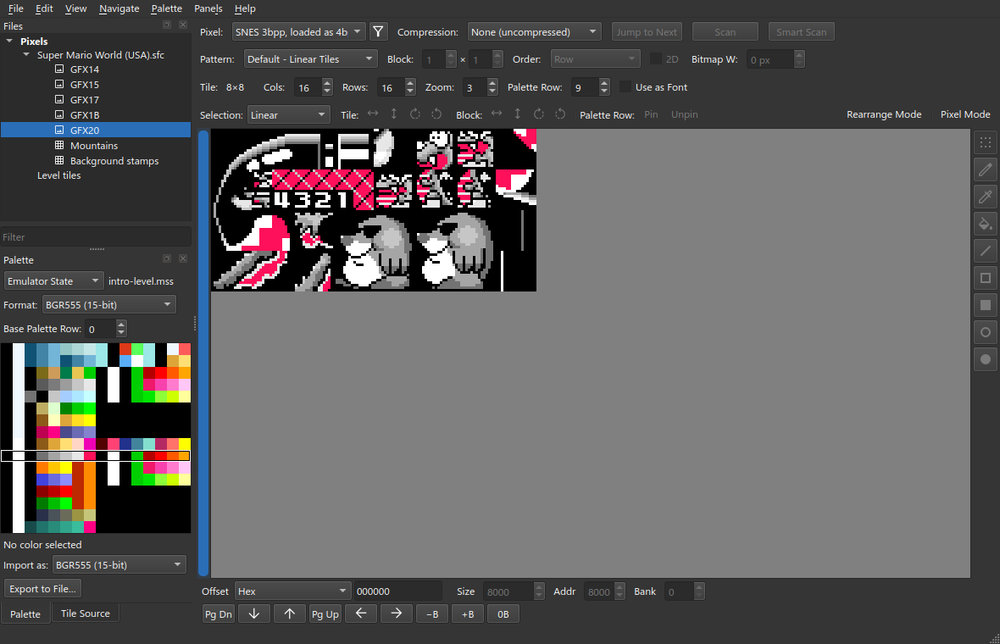
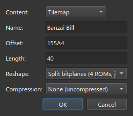
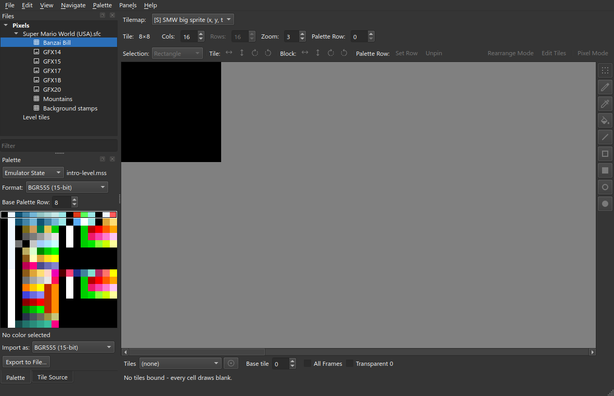
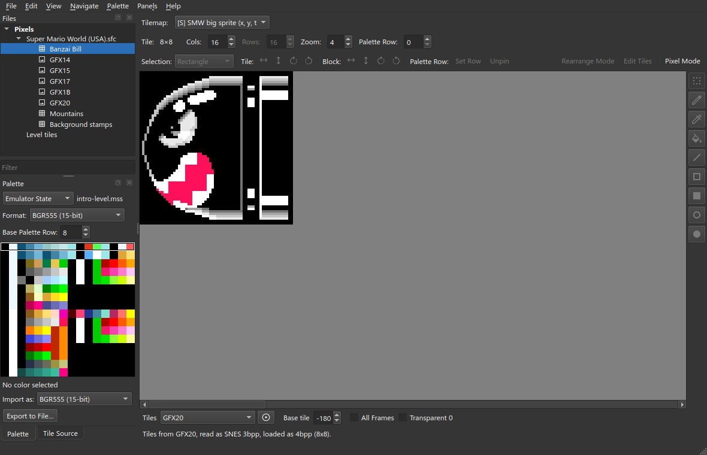
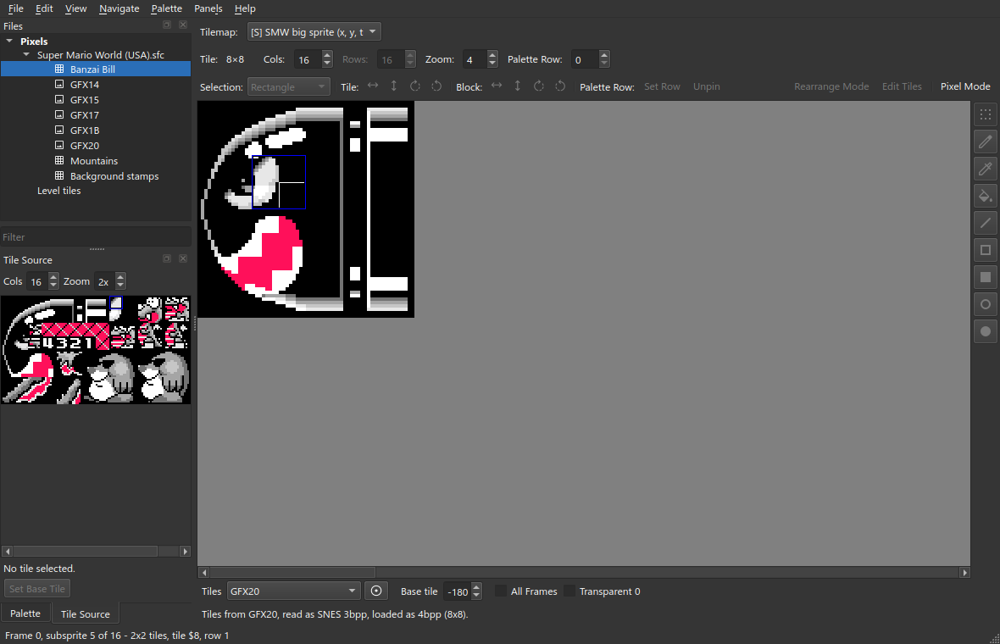
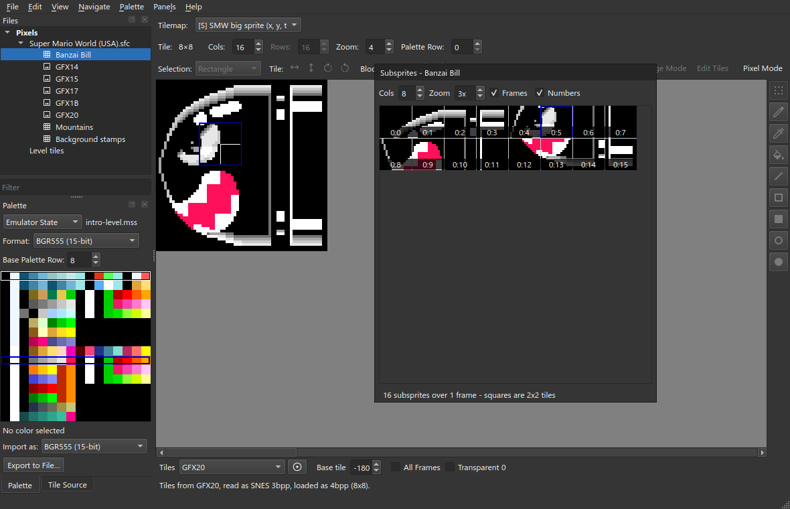
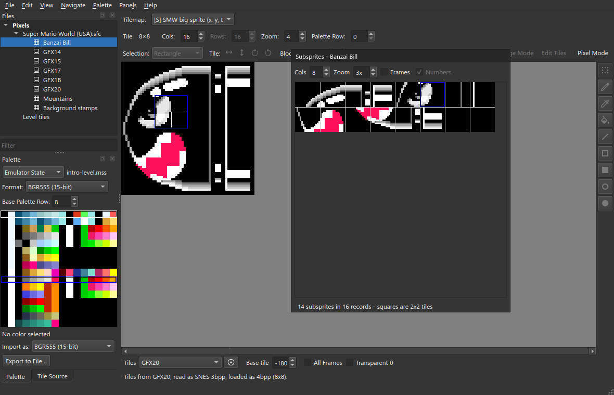
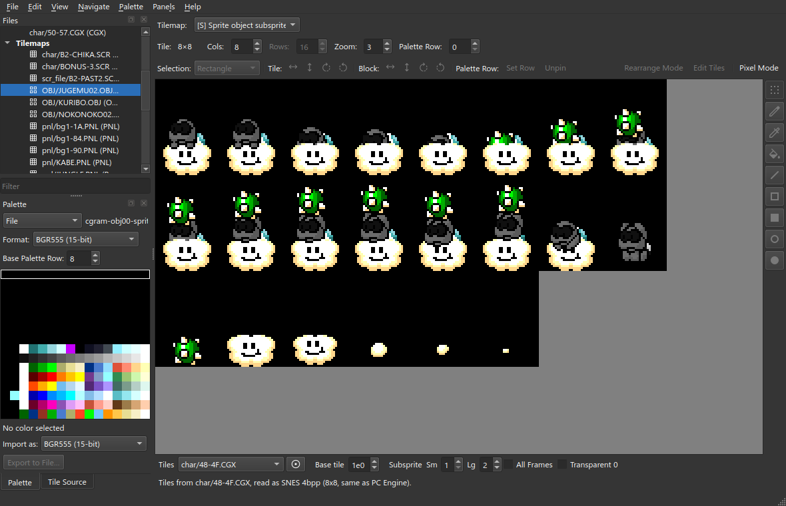
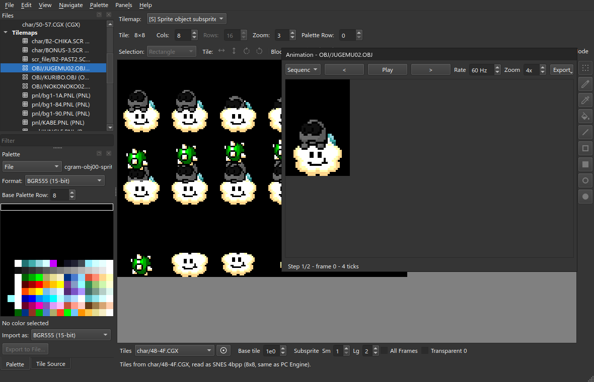

# Sprites

A **sprite map** is a list of records. Each record places a rectangle of tiles
at a pixel offset. celPix draws the records as one object. A sprite format is
marked **[S]**. Its cells cannot be edited on the canvas: edit the sheet.

Start from the project you made in [Getting Started](Getting-Started).

## 1. Carve the sheet

Banzai Bill draws from `GFX20`.

1. Select the ROM in **Files**.
2. **File ▸ New Slice…**. Name `GFX20`, offset `$576A1`, **Compression**
   **LZ2 improved**. Leave **Length** blank.
3. Set the palette to the save state. Set **Palette Row** to 9.

Sprite palettes are CGRAM rows 8 to 15. Banzai Bill uses sprite palette 1.



## 2. The record

The game draws Banzai Bill from four tables at `$155A4`, 16 bytes each: X
offsets, Y offsets, tile numbers, property bytes. A property byte is the OAM
attribute byte `vhoopppt`: flips, priority, palette row, and the top bit of the
tile number. Every object is 16×16. The tables do not say so; the routine does.

A **sprite record** preset states the layout. Save it as
`plugins/tilemap/smw-big-sprite.toml` next to your `.celpix` file, then
**File ▸ Refresh plugins** (F5).

```toml
# A big sprite's tile table, read as the objects its routine draws: one record
# per 16x16 object - X offset, Y offset, tile number, OAM property byte.
id = "preset.tilemap.smw-big-sprite"
name = "SMW big sprite (x, y, tile + OAM properties)"
engine_id = "codec.tilemap.sprite-record"
category = "Project"

[params]
layout = "sprite"
subsprite_size = "stated"
# The tile byte and the property byte read as one little-endian word, so the
# nine-bit tile number is one run: bit 0 of the property byte is its top bit.
endian = "little"
record = [
  { name = "x",    type = "s8" },
  { name = "y",    type = "s8" },
  { name = "attr", type = "u16", bits = "vhoo pppi iiii iiii" },
]
# The record has no size: the routine finishes with every object 16x16.
subsprite_tiles = [2, 2]
# A sprite's palette bits count among the eight sprite rows, CGRAM 8-15.
palette_row_base = 8
```

- `record` lists the fields of one record, in file order.
- `bits` names the bits of a field, most significant first: `i` tile index,
  `p` palette row, `o` priority, `h` and `v` flips, `c` and `r` size.
- `subsprite_tiles` is the size of every record when it has no `c` and `r`
  bits.

## 3. Carve the object

1. Select the ROM in **Files**.
2. **File ▸ New Slice…**, with these values:

| | |
| --- | --- |
| **Content** | Tilemap |
| **Name** | `Banzai Bill` |
| **Offset** | `$155A4` |
| **Length** | `$40` |
| **Reshape** | Split bitplanes (4 ROMs, join) |
| **Compression** | None (uncompressed) |

The reshape joins four equal tables byte by byte. The result is 16 records of
4 bytes: x, y, tile, property.



3. Set **Tilemap** to **[S] SMW big sprite (x, y, tile + OAM properties)**.



4. Set **Tiles** to `GFX20`.
5. Set **Base tile** to `-180`. The tile numbers start at `$180`, the fourth
   sprite slot of VRAM. `GFX20` is that slot, so its tile 0 is tile `$180`.



**Cols** is the number of frames on one row. **Transparent 0** draws colour 0
as nothing.

## 4. Pick a record

Click the object. The record under the pointer is outlined. The **Tile Source**
tab rings its tile. The status bar names it:
`Frame 0, subsprite 5 of 16 - 2x2 tiles, tile $8, row 1`. Where records
overlap, click the same spot again to pick the one behind.



## 5. The Subsprites window

**View ▸ Subsprites…** lists the records: one square each, in file order.
**Numbers** captions each square with `frame:record`.



With **Frames** off, there is one square per distinct piece. Repeats are
removed.



**File ▸ Save Project** (Ctrl+S).

## 6. Sequences

Some formats store animation sequences with the object. S-CG-CAD `.OBJ` files
do. A ROM's own tables usually do not. For an object with sequences,
**View ▸ Animation…** opens the player.

This section uses an S-CG-CAD object, Lakitu. The canvas shows every frame:



- **Sequence** picks a sequence. A sequence is a run of steps. A step is a
  frame and a duration in ticks.
- **Play**, `<` and `>` step through it. **Rate** is ticks per second. 60 reads
  them as console frames.
- **Export ▸ Export as GIF…** writes the sequence as an animated GIF at 1x.
  **Export as PNG Sequence…** writes one PNG per step. The **All** items write
  every sequence.


