# Text and Fonts

Reading and typing **Super Mario World**'s message boxes as words.

A string in a ROM is a tilemap: each code is a tile of a font sheet. What makes
it text is an **alphabet** — what each tile spells — and that belongs to the
font, not to the string. One font sheet, spelled once, reads every string drawn
through it.

Start from the ROM open in a saved project, as in
[Getting Started](Getting-Started) step 1.

## 1. Carve the font

The font is one of the compressed sheets, 2 bits per pixel. Set **Pixel** to
**SNES 2bpp (8x8)**, go to `$5CB7B`, set **Compression** to **LZ2 (SMW, Yoshi's
Island)**.

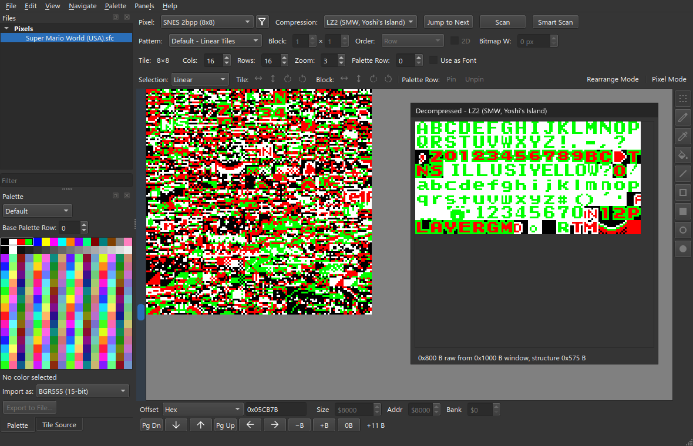

**File ▸ New Slice from View**, named `GFX2A font`.

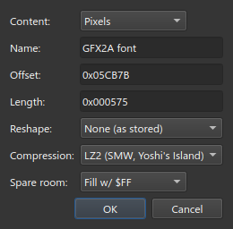

Set **Rows** to 8 and **Zoom** to 3. For colours, take the palette from a save
state ([Getting Started](Getting-Started#3-take-a-palette-from-a-save-state))
and set **Palette Row** to 6.

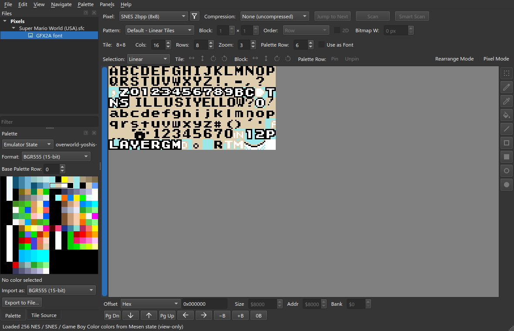

## 2. Spell it

Tick **Use as Font** at the end of the toolbar. The **Font Alphabet** window
opens; **View ▸ Font Alphabet…** brings it back.

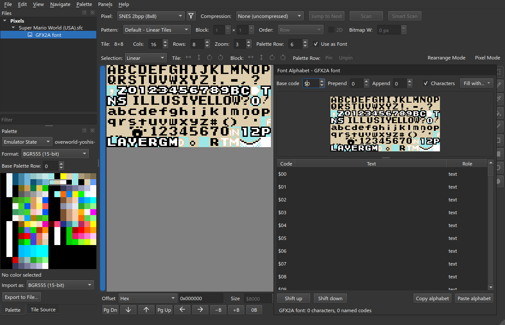

The sheet is on top; the table under it has one row per tile. Drag the divider
down to see more of the sheet, and Ctrl+wheel to zoom it.

There is no box to type a run into. Click the tile where a run starts, and paste
(Ctrl+V): one character per tile, downwards from there.

| Click tile | Paste |
| --- | --- |
| `$00` | `ABCDEFGHIJKLMNOPQRSTUVWXYZ!.-,? ` (ending in the space) |
| `$40` | `abcdefghijklmnopqrstuvwxyz#()'` |
| `$64` | `12345670` |

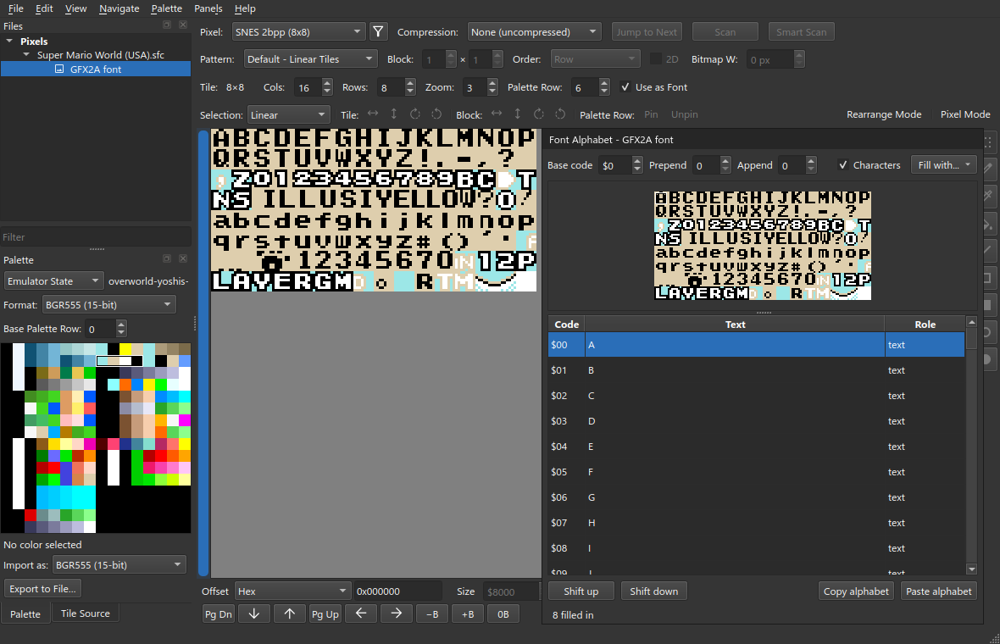

With **Characters** ticked, each spelled tile is captioned with its letter once
the sheet is zoomed in far enough. A tile with no caption spells nothing.

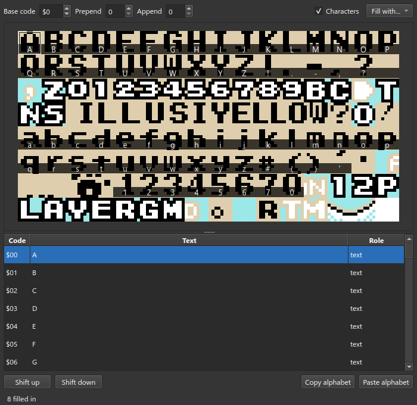

One tile by hand: click it, Enter, type the letter, Enter. **Fill with…** has two
starting runs, `A-Z 0-9, from 0` and `ASCII, from $20`; **Base code** moves the
whole run to start at another code.

## 3. Carve the text

Select the ROM. **File ▸ New Slice…**:

| | |
| --- | --- |
| **Content** | Tilemap |
| **Name** | `Message boxes` |
| **Offset** | `$2A5D9` |
| **Length** | `$B26` |
| **Compression** | None (uncompressed) |

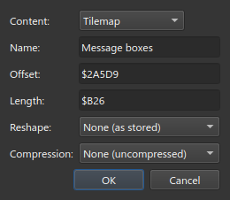

These strings have no end code. The game sets the top bit of a line's last
character instead. Set **Tilemap** to **[F] Text run (8-bit, high bit ends a
line)**, and **Cols** to 18, the width of a message box.

An **[F]** format is a fontmap, and opens the **Text** window. With no font bound
every cell reads as hex.

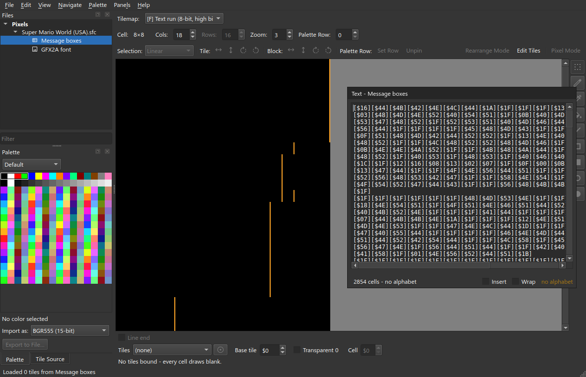

In the bar under the canvas set **Tiles** to `GFX2A font`.

The canvas is the string as the game draws it; the Text window is the string as
words. A line break is a line break: the amber rule on the canvas marks the cell
that carries the bit. Lines shorter than 18 drift the canvas grid, so read the
Text window.

> Bind a fontmap to a sheet that is not ticked and celPix offers to tick it:
> **Use as Font** or **Cancel**.

A code the alphabet does not spell reads as its own hex. `[$60][$61]` and
`[$62][$63]` are Yoshi's paw print, a picture in four tiles. Selecting one in the
Text window selects its cell on the canvas.

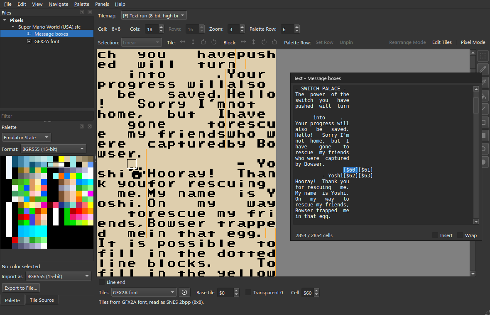

**View ▸ Text…** brings the window back.

## 4. Type

Click in the Text window and type over `Welcome!`.

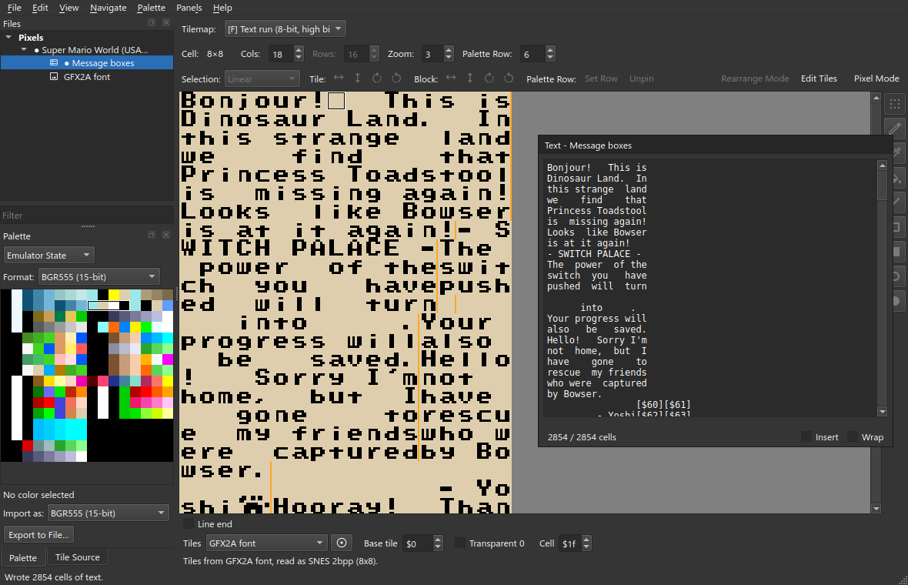

The region is always exactly full — `2854 / 2854 cells` — and typing replaces
cell for cell. A run of typing is one **Edit ▸ Undo edit text** (Ctrl+Z).

- Backspace and Delete blank a cell; they do not close the gap.
- **Insert** pushes the rest along, and what falls off the end is lost. The
  status bar says what went: `'U' pushed off the end`.
- Enter sets the end-of-line bit on the character before it, and costs no cell.
- A character the font has no tile for is written as a blank:
  `'@' has no code in this font`.

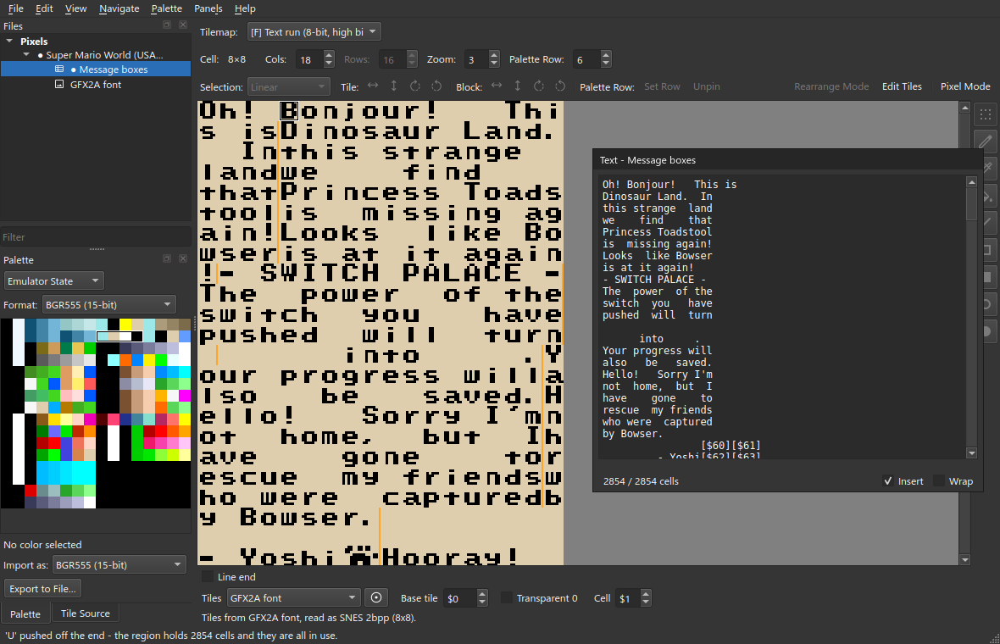

## 5. A second region, the same alphabet

**File ▸ New Slice…** again: Tilemap, `Level names`, `$21AC5`, length `$1CC`.
The same **[F]** format, **Tiles** `GFX2A font`, **Cols** 19.

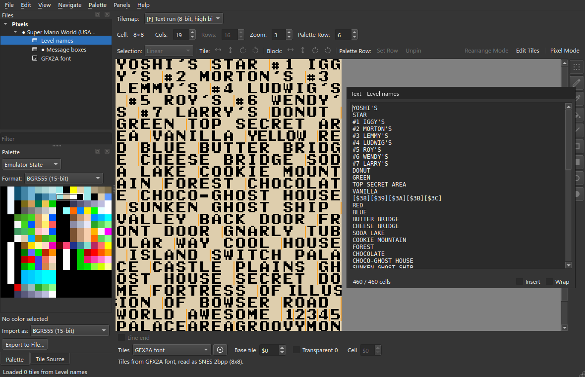

Nothing was spelled twice. `[$38][$39][$3A][$3B][$3C]` is `YELLOW` in a condensed
face whose letters straddle tiles: five tiles, six letters, so no tile of it is a
character.

**File ▸ Write All** (Ctrl+Shift+W), **File ▸ Save Project** (Ctrl+S).

> Unticking **Use as Font** on a spelled sheet deletes its alphabet, after
> asking. Undo brings it back.

## In the sample project

The message boxes, in the game's white on black:

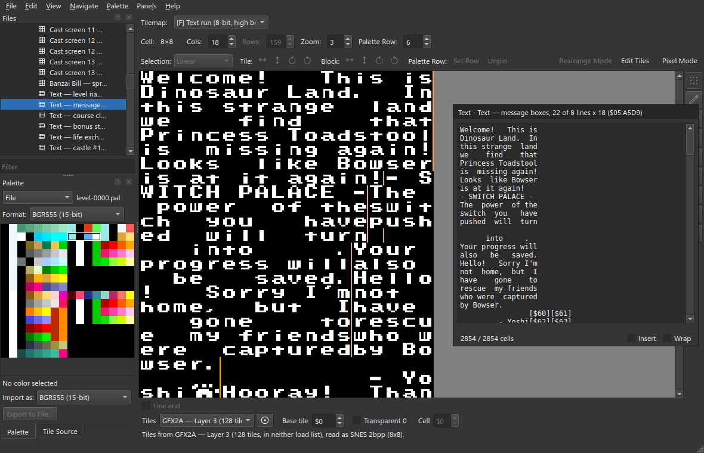

The castle cutscenes are drawn through the same font, stored as a tilemap word
per letter rather than a byte. They need a cell format of their own and no second
alphabet.

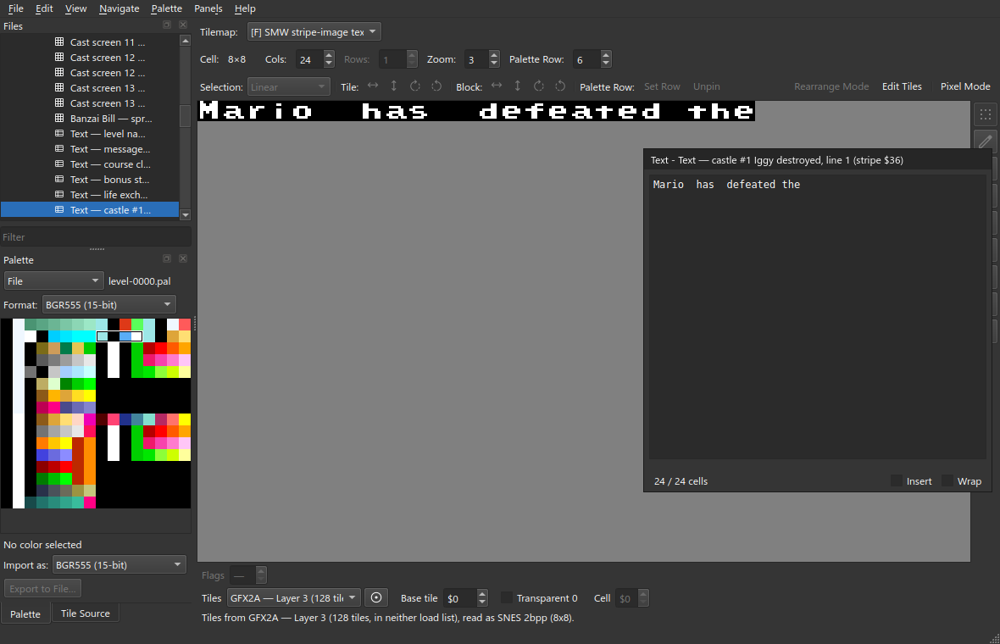

The score-card font, `GFX28`, shows the rest of the alphabet window. A row whose
**Role** is **control** is a named code: `mario1`–`mario5` are the five tiles of a
MARIO banner, and read in a string as `[mario1]`.

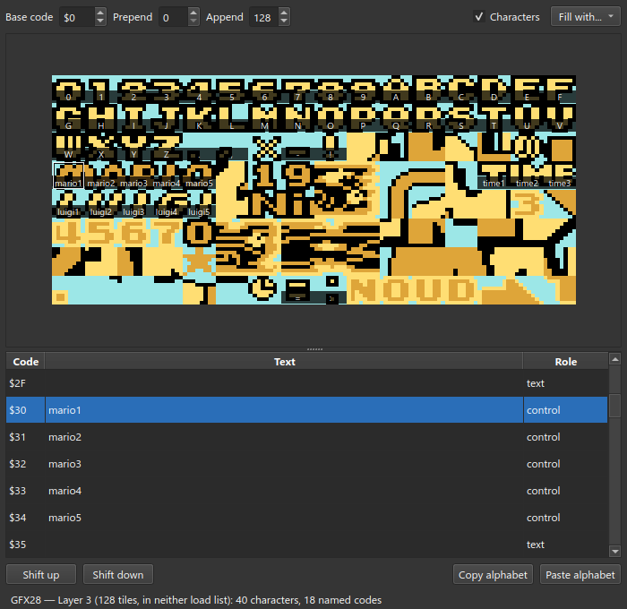

**Append** adds rows past the end of the sheet, for codes the game draws from
somewhere else. Here `$85` and `$86` are `'` and `"`, drawn by the sheet loaded
next door.

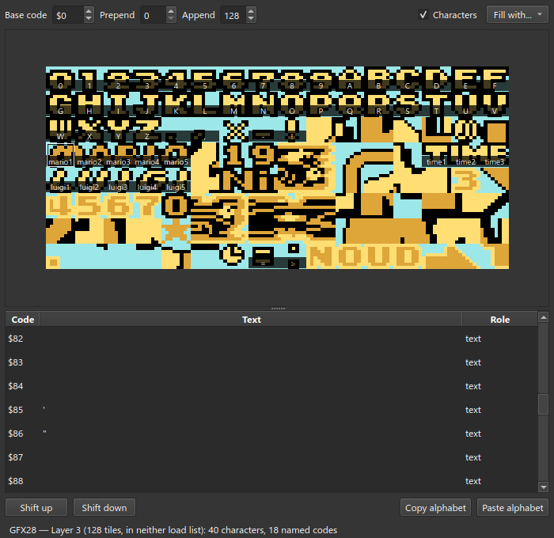
