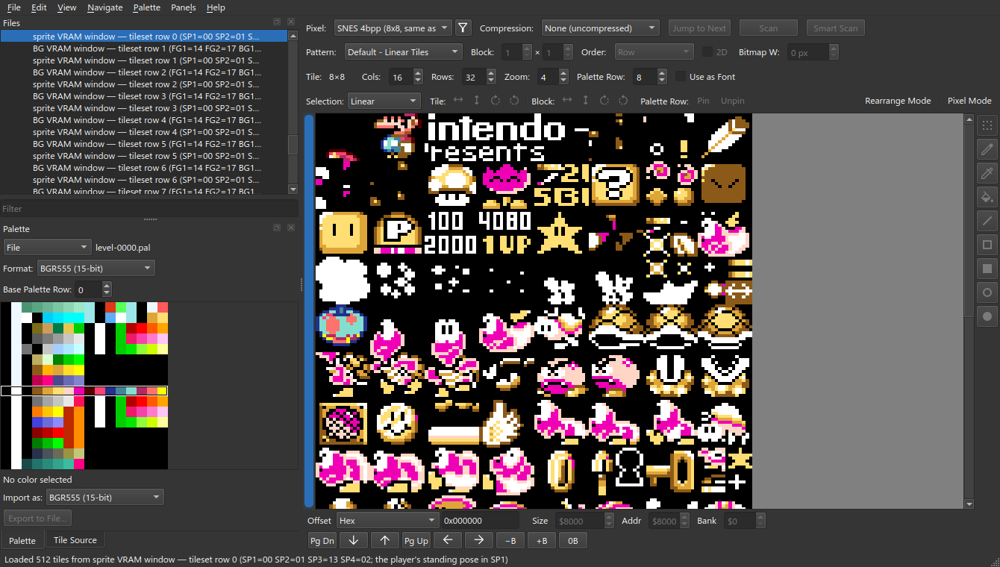

# VRAM Windows

A **composite** mirrors a VRAM window: entries laid end to end as one tile
source. [Getting Started](Getting-Started#6-assemble-the-tile-window) builds a
simple one. This page covers the rest, in the Super Mario World sample project
([opening it](Plugin-Inputs#1-open-a-project-that-has-plugins)).

## 1. A window is what video memory holds

The `?`-block, coin and water are copied in from an animation sheet at load.


Right-click ▸ **Edit…**, and widen the dialog.


**At**, **Tile**, **Bytes**: start and size of each run. A row ending
`[0x001800–0x001880]` is a **byte range** of an entry (here 4 tiles of `GFX33`),
counted in unpacked bytes, so it can cut into compressed sheets.

> The dialog can move or remove ranges but not create them; **Add source…** adds
> whole entries. Ranges live in the project file:
>
> ```json
> { "entry_index": 115, "measured": 128, "offset": 6144, "length": 128 }
> ```

Sprite windows place Mario's tiles from `GFX32` the same way.



## 2. A gap, held open

A slot is 128 tiles; one `THE END` sheet is 64. A **blank** run pads the slot so
later sheets stay aligned.


**File ▸ New Composite View…**, **Add source…** twice, **Add blank**, set its
**Bytes** to 2048 (64 tiles of 4bpp), add the last two sheets.


> Sizes read zero until first assembled:


## 3. A map through a window

`Overworld Layer 2` uses the overworld main map window as its **Tiles**.


In **Tile Source**, clicking a cell rings its tile, in the cell's palette row.


The ring button beside **Tiles** opens the source; **Navigate ▸ Back**
(Alt+Left) returns.


## 4. Editing through a window

Drawing on a composite edits the entry that owns the tile.


This tile appears four times in the window; all four update.


Drawing on a blank does nothing.


**Pixel Mode** on the map also paints through the window to the sheet.
