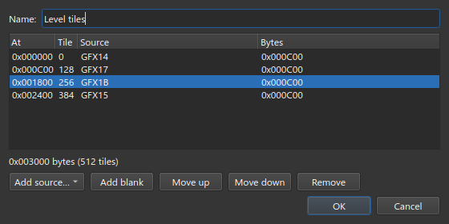
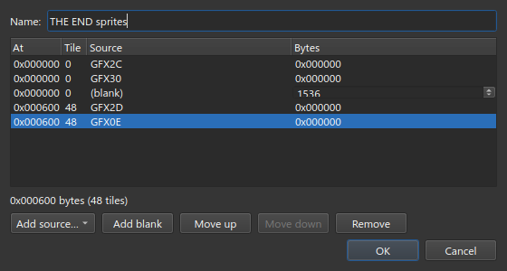
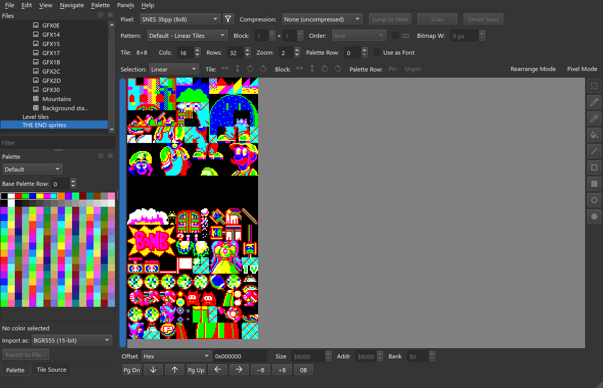
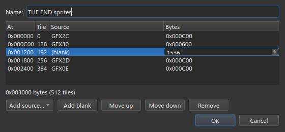
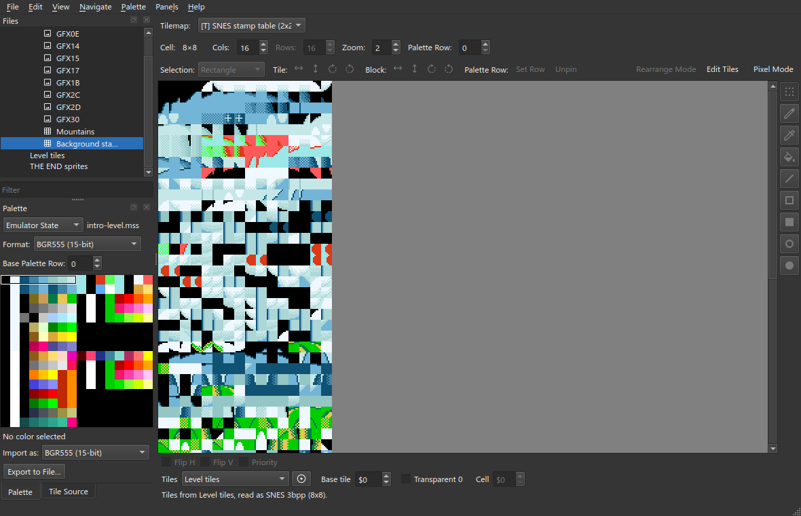
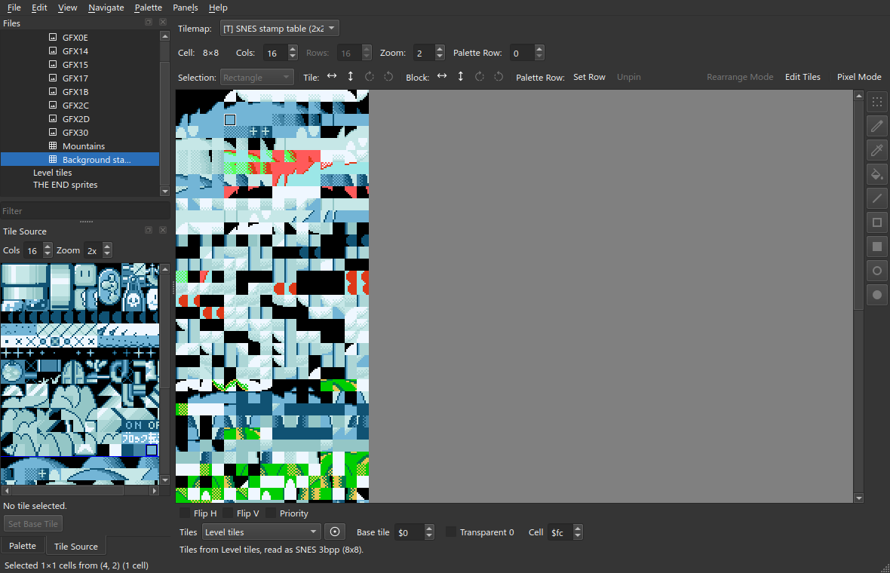
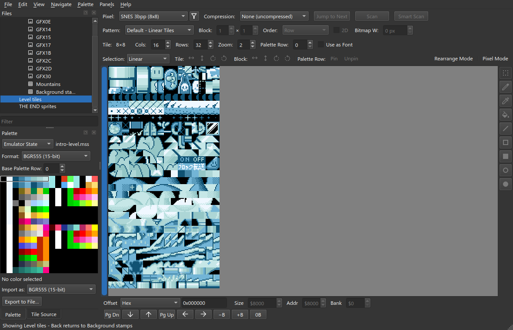
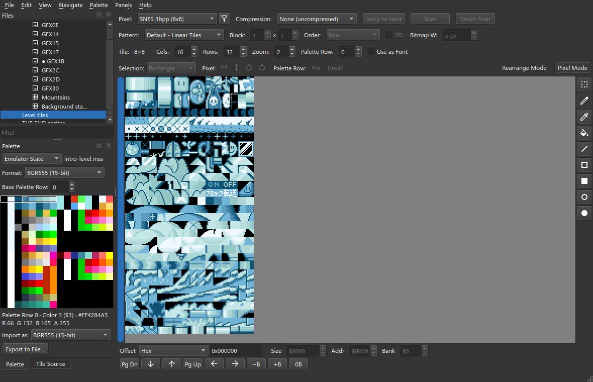
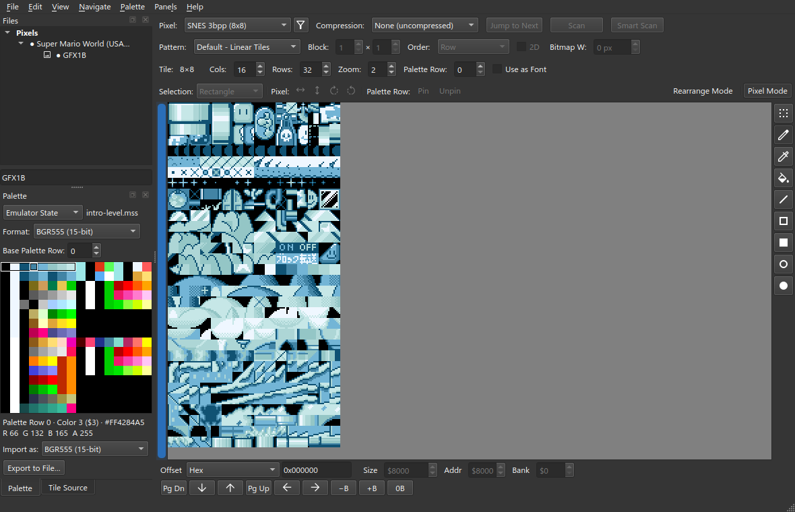
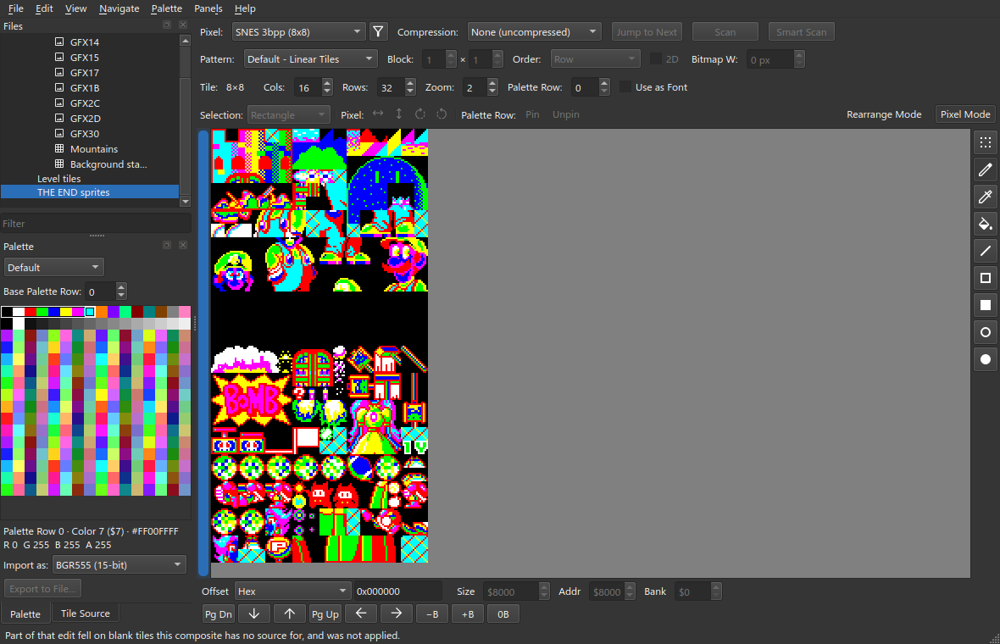

# VRAM Windows

A **composite** is a copy of an area of video memory (VRAM). It puts entries one
after another and uses them as one tile source.
[Getting Started](Getting-Started#6-assemble-the-tile-window) makes a simple
composite. This page shows the other features.

Start from the project you made in [Getting Started](Getting-Started).

## 1. A window is what video memory holds

1. Select `Level tiles`.


2. Right-click ▸ **Edit…**.



**At**, **Tile** and **Bytes** give the start and the size of each piece.

While a level runs, the game copies more tiles into VRAM: the frames of the
`?`-block, coin and water animations, from `GFX33`. They replace tiles `$40` to
`$7F` of this window. To show them, a composite can use part of an entry: a
**byte range**. A byte range counts unpacked bytes, so it can use part of a
compressed sheet.

> The dialog can move or remove ranges. It cannot make new ones. **Add
> source…** adds a whole entry. To add a range, edit the project file. Each
> piece of a composite is one line in its `pieces` list. This piece is 4 tiles
> of entry 7, starting at tile 192 (3bpp, 24 bytes a tile):
>
> ```json
> { "entry_index": 7, "offset": 4608, "length": 96 }
> ```

## 2. A gap, held open

Each VRAM slot is 128 tiles. On the `THE END` screen, the second sprite slot
holds `GFX30`, which is only 64 tiles. A **blank** piece fills the rest of the
slot, so the sheets after it stay in the correct place.

1. Carve these four sheets. Select the ROM in **Files**, then **File ▸ New
   Slice…**. Set **Compression** to **LZ2 improved** and leave **Length** blank.

| Name | Offset |
| --- | --- |
| `GFX2C` | `$5D7B9` |
| `GFX30` | `$5F3BB` |
| `GFX2D` | `$5E006` |
| `GFX0E` | `$4DDCB` |

2. **File ▸ New Composite View…**. Name it `THE END sprites`.
3. Click **Add source…** and add `GFX2C` and `GFX30`.
4. Click **Add blank**.
5. Set the **Bytes** of the blank to 1536. This is 64 tiles of 3bpp, 24 bytes a
   tile.
6. Add `GFX2D` and `GFX0E`.



7. Click OK. Set **Rows** to 32.



> The sizes show 0 until the composite is opened for the first time. After
> that, the dialog shows every piece:



## 3. A map through a window

The **Tiles** setting of `Background stamps` is the `Level tiles` window.



Open the **Tile Source** tab and click a cell. A ring shows the tile that the
cell uses. The tile shows in the palette row of the cell.



To open the tile source, click the ring button next to **Tiles**. To go back:
**Navigate ▸ Back** (Alt+Left).



## 4. Editing through a window

When you draw on a composite, celPix edits the entry that the tile comes from.
Here, the tile comes from `GFX1B`.



`GFX1B` is marked `●`: it has the unsaved change.



Drawing on a blank piece has no effect.



You can also draw on a map in **Pixel Mode**. celPix edits the sheet through
the window.
